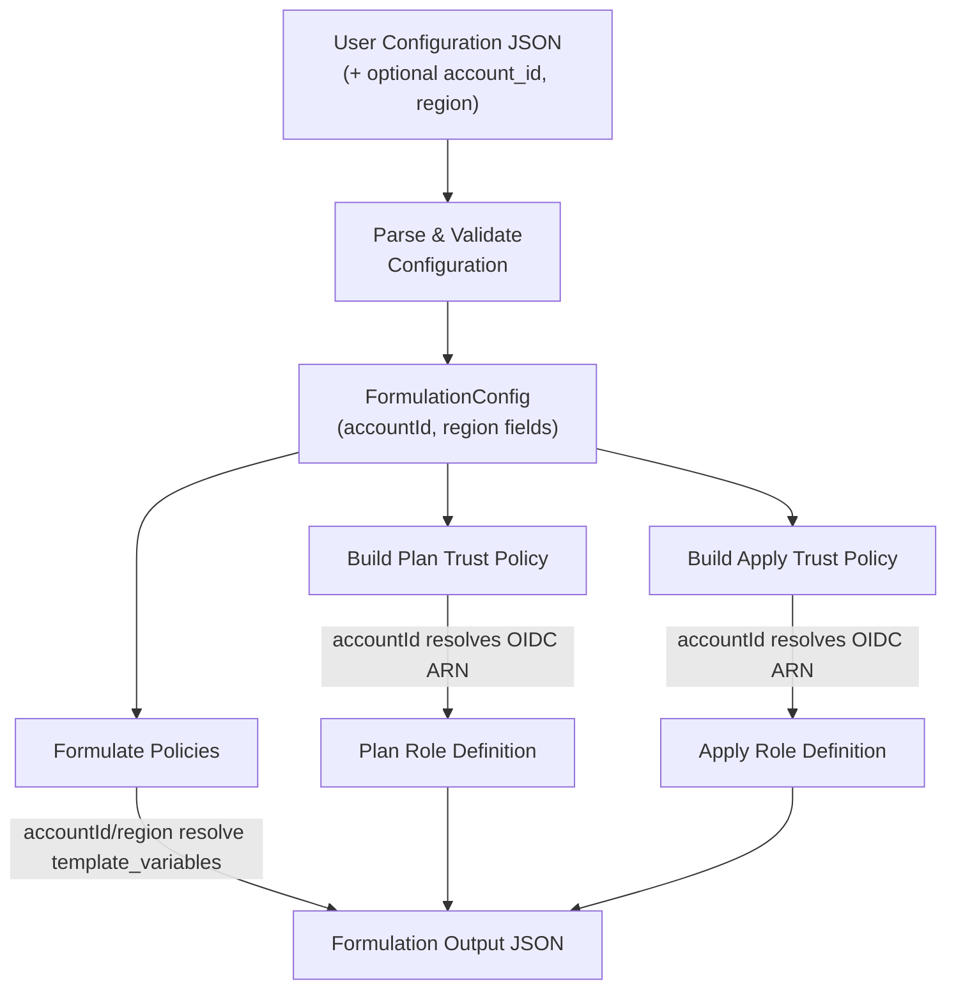
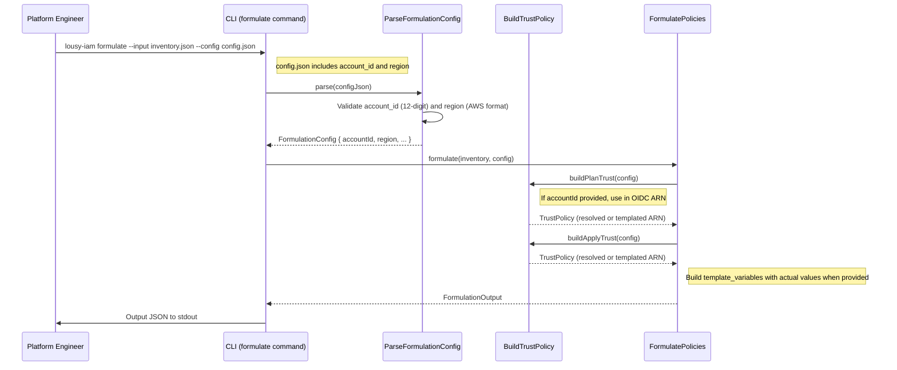

# Feature: Support account_id and region as Configuration Input

## Problem Statement

The formulation step currently uses `${account_id}` and `${region}` as template placeholders in generated IAM policy documents. Users must manually substitute these values after generation. Supporting `account_id` and `region` as optional configuration fields allows the CLI to produce ready-to-deploy policies when values are known, while preserving the template placeholder behavior for users who prefer deferred substitution.

## Personas

| Persona | Impact | Notes |
|---------|--------|-------|
| Platform Engineer | Primary — provides account_id and region in config to get deployment-ready policies | Eliminates manual post-processing of generated policies |
| Security Engineer | Secondary — reviews policies with concrete account/region values for accuracy | Benefits from seeing actual ARNs instead of placeholders |

## Value Assessment

- **Primary value**: Usability — reduces manual steps between policy generation and deployment
- **Secondary value**: Accuracy — concrete ARNs are easier to audit than templated placeholders
- **Tertiary value**: Flexibility — optional fields preserve backward compatibility with template-based workflows

## User Stories

### Story 1: Provide account_id in Configuration

As a **platform engineer**,
I want to **provide an AWS account ID in the formulation configuration file**,
so that **generated trust policies contain the actual OIDC provider ARN instead of a placeholder**.

#### Acceptance Criteria

- Where `account_id` is provided in the configuration, the `CLI` shall substitute the value into the OIDC provider ARN in trust policies.
- Where `account_id` is not provided in the configuration, the `CLI` shall use the `${account_id}` template placeholder in trust policies.
- If `account_id` is provided but is not a valid 12-digit AWS account ID, then the `CLI` shall display a validation error.
- Where `account_id` is provided, the `CLI` shall display the actual account ID in the `template_variables` output section.

### Story 2: Provide region in Configuration

As a **platform engineer**,
I want to **provide an AWS region in the formulation configuration file**,
so that **generated policies reflect the target deployment region**.

#### Acceptance Criteria

- Where `region` is provided in the configuration, the `CLI` shall record the actual region value in the `template_variables` output section.
- Where `region` is not provided in the configuration, the `CLI` shall use the descriptive placeholder text in the `template_variables` output section.
- If `region` is provided but is not a valid AWS region identifier, then the `CLI` shall display a validation error.

---

## Design

### Data Flow Diagram

### Sequence Diagram

### Components Affected

| Layer | Component | File | Change |
|-------|-----------|------|--------|
| Entity | FormulationConfig | `src/entities/formulation-config.ts` | Add `accountId` and `region` fields |
| Use Case | FormulationConfigSchema | `src/use-cases/formulation-config.schema.ts` | Add optional `accountId` and `region` with validation |
| Use Case | ParseFormulationConfig | `src/use-cases/parse-formulation-config.ts` | Add snake_case mappings for new fields |
| Use Case | BuildTrustPolicy | `src/use-cases/build-trust-policy.ts` | Use `accountId` in OIDC ARN when provided |
| Use Case | FormulatePolicies | `src/use-cases/formulate-policies.ts` | Resolve template variables when config values provided |

### Architecture Decisions

1. **Optional fields with null defaults**: `accountId` and `region` default to `null`, preserving full backward compatibility. Existing configs without these fields continue to work identically.
2. **Validation at schema boundary**: AWS account ID (12-digit) and region format validation happens in the Zod schema, keeping business logic in use cases clean.
3. **Trust policy ARN resolution**: When `accountId` is provided, the trust policy builder substitutes it into the OIDC provider ARN. This is the only place where `account_id` directly affects policy content.
4. **Template variables as documentation**: The `template_variables` output section reflects actual values when provided, serving as a record of what was used during generation.

---

## Tasks

### Task 1: Add accountId and region to FormulationConfig Entity

**Objective**: Extend the FormulationConfig entity with optional `accountId` and `region` fields.

**Context**: The entity layer defines the domain type. Both fields are optional (nullable) to preserve backward compatibility.

**Affected files**:
- `src/entities/formulation-config.ts`

**Requirements**: Supports Stories 1, 2.

**Verification**:
- [x] `npm test` passes
- [x] `npx biome check` passes
- [x] `npm run build` passes

### Task 2: Update Schema and Parser for account_id and region

**Objective**: Add Zod validation for optional `accountId` (12-digit AWS account ID) and `region` (AWS region format) fields, and update the snake_case parser.

**Context**: The schema validates external input. Account IDs must be exactly 12 digits. Regions must match the AWS region pattern (e.g., `us-east-1`). Both fields default to `null` when not provided.

**Affected files**:
- `src/use-cases/formulation-config.schema.ts`
- `src/use-cases/formulation-config.schema.test.ts`
- `src/use-cases/parse-formulation-config.ts`
- `src/use-cases/parse-formulation-config.test.ts`

**Requirements**: Covers Stories 1, 2 validation acceptance criteria.

**Verification**:
- [x] `npm test` passes
- [x] `npx biome check` passes
- [x] Schema accepts valid account_id and region
- [x] Schema rejects invalid account_id format
- [x] Schema rejects invalid region format
- [x] Schema defaults both to null when omitted
- [x] Parser transforms snake_case `account_id` to camelCase `accountId`

### Task 3: Update Trust Policy Builder for accountId Resolution

**Objective**: When `accountId` is provided in config, substitute it into the OIDC provider ARN instead of using the `${account_id}` placeholder.

**Context**: The trust policy builder generates the OIDC provider ARN. Currently it always uses `${account_id}` placeholder. When the user provides an actual account ID, the builder should produce a concrete ARN.

**Affected files**:
- `src/use-cases/build-trust-policy.ts`
- `src/use-cases/build-trust-policy.test.ts`

**Requirements**: Covers Story 1 acceptance criteria for trust policy substitution.

**Verification**:
- [x] `npm test` passes
- [x] `npx biome check` passes
- [x] Trust policy uses actual account ID in ARN when provided
- [x] Trust policy uses `${account_id}` placeholder when accountId is null

### Task 4: Update Formulate Policies for Template Variable Resolution

**Objective**: When `accountId` or `region` are provided in config, use actual values in the `template_variables` output section.

**Context**: The formulate-policies use case assembles the output including a `template_variables` record. When concrete values are provided, these should replace the descriptive placeholder text.

**Affected files**:
- `src/use-cases/formulate-policies.ts`
- `src/use-cases/formulate-policies.test.ts`

**Requirements**: Covers Stories 1, 2 template_variables acceptance criteria.

**Verification**:
- [x] `npm test` passes
- [x] `npx biome check` passes
- [x] template_variables shows actual account_id when provided
- [x] template_variables shows actual region when provided
- [x] template_variables shows descriptive placeholders when values are null
