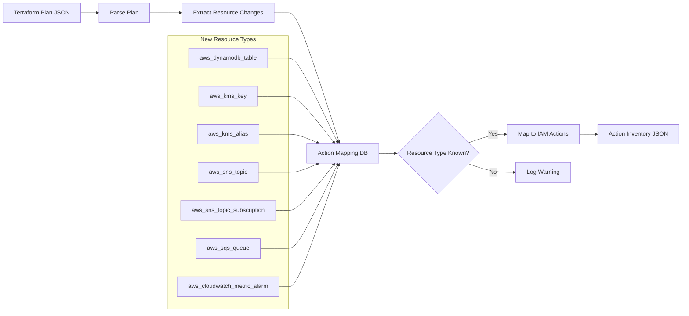
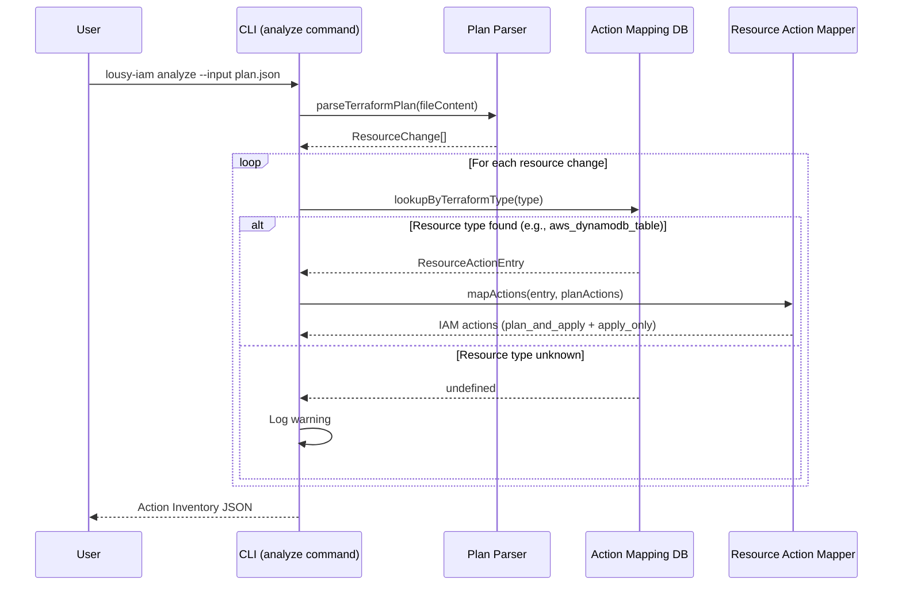

# Feature: Add Support for New Resource Types

## Problem Statement

The action mapping database currently supports 16 AWS resource types. Platform engineers using DynamoDB, KMS, SNS, SQS, and CloudWatch metric alarms in their Terraform plans receive warnings about unknown resource types and cannot generate accurate IAM policies for these commonly used services. Expanding the mapping database eliminates manual IAM action lookup for these resource types.

## Personas

| Persona | Impact | Notes |
|---------|--------|-------|
| Platform Engineer | Primary — needs IAM action mappings for DynamoDB, KMS, SNS, SQS, CloudWatch resources | Currently gets unknown resource warnings for these types |
| Security Engineer | Secondary — reviews generated policies for least-privilege compliance | Benefits from accurate mappings instead of manual overrides |

## Value Assessment

- **Primary value**: Coverage — extends automated IAM action mapping to 7 additional, commonly used AWS resource types
- **Secondary value**: Accuracy — uses structured mapping database for precise least-privilege policies
- **Tertiary value**: Adoption — reduces friction for teams using these popular AWS services

## User Stories

### Story 1: DynamoDB Table Action Mapping

As a **platform engineer**,
I want the **CLI to map `aws_dynamodb_table` resources to DynamoDB IAM actions**,
so that I can **generate least-privileged IAM policies for DynamoDB table operations**.

#### Acceptance Criteria

- When a Terraform plan contains an `aws_dynamodb_table` resource with a `create` action, the `CLI` shall return DynamoDB create, read, and tag IAM actions.
- When a Terraform plan contains an `aws_dynamodb_table` resource with an `update` action, the `CLI` shall return DynamoDB update, read, and tag IAM actions.
- When a Terraform plan contains an `aws_dynamodb_table` resource with a `delete` action, the `CLI` shall return DynamoDB delete and read IAM actions.

### Story 2: KMS Key and Alias Action Mapping

As a **platform engineer**,
I want the **CLI to map `aws_kms_key` and `aws_kms_alias` resources to KMS IAM actions**,
so that I can **generate least-privileged IAM policies for KMS key management**.

#### Acceptance Criteria

- When a Terraform plan contains an `aws_kms_key` resource, the `CLI` shall return KMS IAM actions for the requested operation categories.
- When a Terraform plan contains an `aws_kms_alias` resource, the `CLI` shall return KMS IAM actions for alias management.

### Story 3: SNS Topic and Subscription Action Mapping

As a **platform engineer**,
I want the **CLI to map `aws_sns_topic` and `aws_sns_topic_subscription` resources to SNS IAM actions**,
so that I can **generate least-privileged IAM policies for SNS messaging infrastructure**.

#### Acceptance Criteria

- When a Terraform plan contains an `aws_sns_topic` resource, the `CLI` shall return SNS IAM actions for topic management.
- When a Terraform plan contains an `aws_sns_topic_subscription` resource, the `CLI` shall return SNS IAM actions for subscription management.

### Story 4: SQS Queue Action Mapping

As a **platform engineer**,
I want the **CLI to map `aws_sqs_queue` resources to SQS IAM actions**,
so that I can **generate least-privileged IAM policies for SQS queue operations**.

#### Acceptance Criteria

- When a Terraform plan contains an `aws_sqs_queue` resource with a `create` action, the `CLI` shall return SQS create, read, and tag IAM actions.
- When a Terraform plan contains an `aws_sqs_queue` resource with an `update` action, the `CLI` shall return SQS update, read, and tag IAM actions.
- When a Terraform plan contains an `aws_sqs_queue` resource with a `delete` action, the `CLI` shall return SQS delete and read IAM actions.

### Story 5: CloudWatch Metric Alarm Action Mapping

As a **platform engineer**,
I want the **CLI to map `aws_cloudwatch_metric_alarm` resources to CloudWatch IAM actions**,
so that I can **generate least-privileged IAM policies for CloudWatch monitoring**.

#### Acceptance Criteria

- When a Terraform plan contains an `aws_cloudwatch_metric_alarm` resource, the `CLI` shall return CloudWatch IAM actions for alarm management.

---

## Design

### Architecture

The new resource types follow the existing action mapping database pattern. Each resource type is added as a `ResourceActionEntry` in the `RESOURCE_ACTIONS` array within `src/gateways/action-mapping-db.ts`. No architectural changes are required — this is purely a data addition to the existing gateway layer.

### Data Flow Diagram

### Sequence Diagram

### Affected Files

| File | Change |
|------|--------|
| `src/gateways/action-mapping-db.ts` | Add 7 new `ResourceActionEntry` objects to `RESOURCE_ACTIONS` array |
| `src/gateways/action-mapping-db.test.ts` | Add test cases for each new resource type lookup |

---

## Tasks

### Task 1: Add DynamoDB, KMS, SNS, SQS, and CloudWatch Resource Type Mappings

- [x] **Objective**: Add 7 new resource type entries to the action mapping database with corresponding tests.

**Context**: The action mapping database is the central lookup for translating Terraform resource types to IAM actions. Each entry defines read, create, update, delete, and tag action arrays for a specific Terraform resource type.

**Affected files**:
- `src/gateways/action-mapping-db.ts`
- `src/gateways/action-mapping-db.test.ts`

**Requirements**: Stories 1–5 acceptance criteria.

**Verification**:
- [x] `npx biome check` passes
- [x] `npm test` passes
- [x] `npm run build` passes
- [x] Each new resource type returns correct service name and action arrays
- [x] Unknown resource types still return undefined
