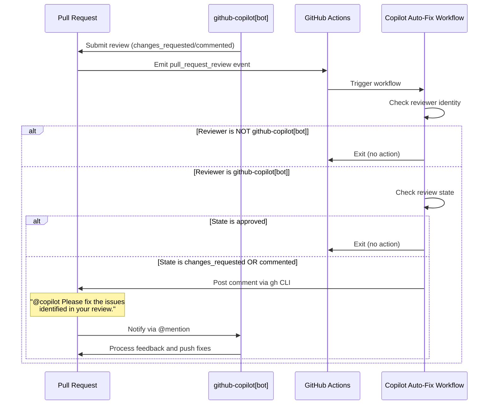

# Feature: Copilot Auto-Fix Loop Workflow

## Problem Statement

When GitHub Copilot reviews a pull request and requests changes or leaves comments, developers must manually read the feedback and either fix issues themselves or copy-paste the feedback back to Copilot to request fixes. This manual step adds friction to the development workflow and slows down the iteration cycle, especially when Copilot is capable of addressing its own feedback.

## Personas

| Persona | Impact | Notes |
|---------|--------|-------|
| Developer | Primary beneficiary | Spends less time manually relaying feedback between Copilot review and Copilot fixes |
| CI/CD Pipeline | Automation actor | Executes the workflow that triggers Copilot to address its own review comments |

## Value Assessment

- **Primary value**: Efficiency — Eliminates manual copy-paste of Copilot review feedback, reducing developer context-switching
- **Secondary value**: Developer experience — Creates a seamless loop where Copilot can iterate on its own code

---

## User Stories

### Story 1: Automatic Copilot Fix Request on Review Feedback

As a **Developer**,
I want **the CI/CD pipeline to automatically instruct Copilot to fix its own code when it flags issues during a review**,
so that I can **avoid manually copy-pasting feedback to the bot and reduce time spent on review iterations**.

#### Acceptance Criteria

- When a `pull_request_review` event is submitted, the Copilot Auto-Fix Workflow shall execute.
- When the workflow executes, if the reviewer identity (`github.event.review.user.login`) is strictly `github-copilot[bot]` AND the review state is strictly `changes_requested` or `commented`, the Copilot Auto-Fix Workflow shall proceed to the comment step.
- If the review state is `approved`, then the Copilot Auto-Fix Workflow shall exit without posting a comment.
- When the comment step is triggered, the Copilot Auto-Fix Workflow shall use the GitHub CLI (`gh`) to post a comment on the Pull Request containing strictly the text: `@copilot Please fix the issues identified in your review.`
- The Copilot Auto-Fix Workflow shall possess `issues: write` permissions to enable posting comments via `gh pr comment`.

#### Notes

- The workflow should only respond to reviews from `github-copilot[bot]`, not from human reviewers
- The comment uses `@copilot` mention to trigger Copilot's response mechanism
- No action is needed for approved reviews since there are no issues to fix
- The workflow posts an issue comment on the pull request via `gh pr comment`, which requires `issues: write` permissions to succeed.

---

## Design

### Data Flow Diagram

```mermaid
flowchart TD
    subgraph Trigger["GitHub Event"]
        PR_REVIEW["pull_request_review event\n(submitted)"]
    end

    subgraph Workflow["Copilot Auto-Fix Workflow"]
        CHECK_REVIEWER{"Reviewer ==\ngithub-copilot[bot]?"}
        CHECK_STATE{"Review state ==\nchanges_requested\nOR commented?"}
        POST_COMMENT["Post comment:\n@copilot Please fix the issues\nidentified in your review."]
        EXIT_SKIP["Exit without action"]
    end

    subgraph Output["GitHub Actions"]
        PR_COMMENT["PR Comment Created"]
        COPILOT_TRIGGERED["Copilot receives\n@mention notification"]
    end

    PR_REVIEW --> CHECK_REVIEWER
    CHECK_REVIEWER -->|No| EXIT_SKIP
    CHECK_REVIEWER -->|Yes| CHECK_STATE
    CHECK_STATE -->|No (approved)| EXIT_SKIP
    CHECK_STATE -->|Yes| POST_COMMENT
    POST_COMMENT --> PR_COMMENT
    PR_COMMENT --> COPILOT_TRIGGERED
```

### Sequence Diagram



### Components Affected

| Component | Change Type | Description |
|-----------|-------------|-------------|
| `.github/workflows/copilot-autofix.yml` | New file | GitHub Actions workflow for auto-fix loop |

### Dependencies

- GitHub CLI (`gh`) - Pre-installed on GitHub Actions runners
- `GITHUB_TOKEN` - Automatically provided by GitHub Actions with appropriate permissions

### Open Questions

None - requirements are fully specified in the acceptance criteria.

---

## Tasks

### Task 1: Create Copilot Auto-Fix Workflow

**Objective**: Create a new GitHub Actions workflow that triggers on Copilot reviews and posts a fix request comment.

**Context**: This workflow automates the feedback loop between Copilot's review capability and its coding capability, reducing manual developer intervention.

**Affected files**:
- `.github/workflows/copilot-autofix.yml` (new)

**Requirements** (links to acceptance criteria):
- Event-driven: Trigger on `pull_request_review` submitted event
- Complex: Check reviewer identity AND review state before proceeding
- Unwanted: Skip approved reviews
- Functional: Post standardized comment using `gh` CLI
- Ubiquitous: Configure `pull-requests: write` permission

**Verification**:
- [x] Workflow file exists at `.github/workflows/copilot-autofix.yml`
- [x] Workflow triggers on `pull_request_review` event with `submitted` type
- [x] Workflow checks `github.event.review.user.login == 'github-copilot[bot]'`
- [x] Workflow checks review state is `changes_requested` or `commented`
- [x] Workflow skips when review state is `approved`
- [x] Workflow posts comment with exact text: `@copilot Please fix the issues identified in your review.`
- [x] Workflow has `pull-requests: write` permission
- [x] `npm run lint:workflows` passes
- [x] `npm run lint:yaml` passes
