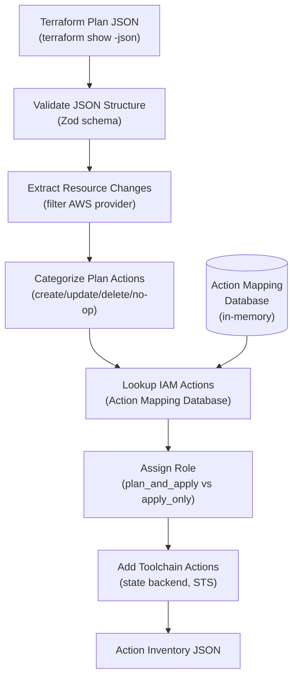
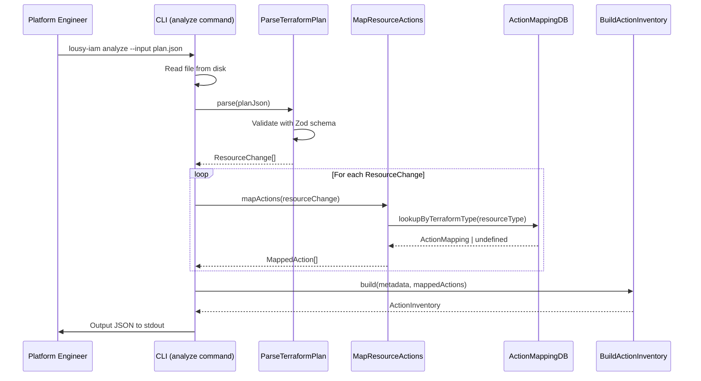

# Feature: Phase 1 — Plan/Synth Analysis

## Problem Statement

Engineers deploying AWS infrastructure via CI/CD need least-privileged IAM policies, but manually determining the exact IAM actions required for each resource in a Terraform plan or CDK synth output is error-prone, tedious, and often results in overly broad permissions. This tool needs to parse plan/synth JSON, extract resource changes, and map them to precise IAM actions to produce a structured action inventory for downstream policy generation.

## Personas

| Persona | Impact | Notes |
|---------|--------|-------|
| Platform Engineer | Primary — uses the CLI to generate action inventories from plan JSON | Needs accurate, complete IAM action mappings |
| Security Engineer | Secondary — reviews generated policies for least-privilege compliance | Benefits from structured, auditable output |

## Value Assessment

- **Primary value**: Automation — eliminates manual IAM action lookup for each resource type
- **Secondary value**: Accuracy — uses structured mapping database instead of human guesswork
- **Tertiary value**: Auditability — produces structured JSON inventory with traceability metadata

## User Stories

### Story 1: Parse Terraform Plan JSON

As a **platform engineer**,
I want to **provide a Terraform plan JSON file to the CLI**,
so that I can **have it automatically extract all resource changes and their planned operations**.

#### Acceptance Criteria

- When a user provides a valid Terraform plan JSON file, the `CLI` shall parse and extract all `resource_changes` entries.
- When a resource change entry has `provider_name` containing `hashicorp/aws`, the `CLI` shall include it in the extraction result.
- If a resource change entry has a `provider_name` not containing `hashicorp/aws`, then the `CLI` shall exclude it from the extraction result.
- When a resource change has `change.actions` of `["no-op"]`, the `CLI` shall categorize it as requiring read-only IAM actions.
- When a resource change has `change.actions` of `["create"]`, the `CLI` shall categorize it as requiring create, read, and tag IAM actions.
- When a resource change has `change.actions` of `["update"]`, the `CLI` shall categorize it as requiring update, read, and tag IAM actions.
- When a resource change has `change.actions` of `["delete"]`, the `CLI` shall categorize it as requiring delete and read IAM actions.
- When a resource change has `change.actions` of `["create", "delete"]`, the `CLI` shall categorize it as requiring create, delete, read, and tag IAM actions (resource replacement).
- If the input file is not valid JSON, then the `CLI` shall display a descriptive validation error.
- If the input JSON does not contain a `resource_changes` array, then the `CLI` shall display an error indicating the file is not a valid Terraform plan.

#### Notes

- The `format_version` and `terraform_version` fields provide metadata for the action inventory output.
- The `change.after` attributes are used for implicit dependency detection.

### Story 2: Map Resource Types to IAM Actions

As a **platform engineer**,
I want the **CLI to automatically map each extracted resource type to the specific IAM actions required**,
so that I can **get a complete list of permissions without manually looking up AWS documentation**.

#### Acceptance Criteria

- The `CLI` shall maintain an action mapping database that maps AWS resource types to IAM actions per CRUD operation.
- When a resource type is found in the action mapping database, the `CLI` shall return the corresponding IAM actions for the requested operation categories.
- If a resource type is not found in the action mapping database, then the `CLI` shall log a warning identifying the unknown resource type.
- When mapping actions for a `create` operation, the `CLI` shall include the `create`, `read`, and `tag` action categories from the database entry.
- When mapping actions for an `update` operation, the `CLI` shall include the `update`, `read`, and `tag` action categories from the database entry.
- When mapping actions for a `delete` operation, the `CLI` shall include the `delete` and `read` action categories from the database entry.
- When mapping actions for a `no-op` or `read` operation, the `CLI` shall include only the `read` action categories from the database entry.

### Story 3: Produce Action Inventory Output

As a **platform engineer**,
I want the **CLI to produce a structured JSON action inventory**,
so that I can **feed it into downstream policy generation (Phase 2)**.

#### Acceptance Criteria

- When analysis is complete, the `CLI` shall produce a JSON action inventory containing `metadata`, `toolchain_actions`, and `infrastructure_actions` sections.
- The `metadata` section shall include `iac_tool`, `iac_version`, and `format_version` fields extracted from the plan JSON.
- The `infrastructure_actions` section shall separate actions into `plan_and_apply` and `apply_only` arrays.
- When a resource action is categorized as `read`, the `CLI` shall assign it to the `plan_and_apply` role.
- When a resource action is categorized as `create`, `update`, `delete`, or `tag`, the `CLI` shall assign it to the `apply_only` role.
- The `CLI` shall include Terraform state backend toolchain actions in the `toolchain_actions` section.
- Each action entry shall include `action`, `resource`, `purpose`, `source_resource`, `plan_action`, and `category` fields.

---

## Design

### Data Flow Diagram

### Sequence Diagram

### Components Affected

| Layer | Component | File | Purpose |
|-------|-----------|------|---------|
| Entity | TerraformPlan | `src/entities/terraform-plan.ts` | TypeScript types for plan JSON |
| Entity | ActionInventory | `src/entities/action-inventory.ts` | Types for action inventory output |
| Entity | ResourceActions | `src/entities/resource-actions.ts` | Types and logic for resource-to-action mapping |
| Use Case | ParseTerraformPlan | `src/use-cases/parse-terraform-plan.ts` | Parse and validate plan JSON, extract resource changes |
| Use Case | MapResourceActions | `src/use-cases/map-resource-actions.ts` | Map resource types to IAM actions using database |
| Use Case | BuildActionInventory | `src/use-cases/build-action-inventory.ts` | Assemble final action inventory from mapped actions |
| Gateway | ActionMappingDB | `src/gateways/action-mapping-db.ts` | In-memory action mapping database |
| Command | AnalyzeCommand | `src/commands/analyze.ts` | CLI command handler |
| Root | index.ts | `src/index.ts` | Wire analyze subcommand |

### Architecture Decision: In-Memory Database

For Phase 1, the action mapping database is implemented as an in-memory TypeScript data structure rather than YAML files on disk. This simplifies the initial implementation while maintaining the same interface. Future phases can swap to file-based YAML loading without changing the use case layer.

### Dependencies

- Runtime: No new runtime dependencies — feature code uses existing `zod`, `citty`, `consola`.
- Dev/Test: New dev dependency `testcontainers` for end-to-end coverage (spinning up ephemeral services to validate the CLI against real integrations).

### Open Questions

- None for Phase 1 scope

---

## Tasks

### Task 1: Create Terraform Plan JSON Entity

**Objective**: Define TypeScript entity types for the Terraform plan JSON structure and Zod schemas for runtime validation in the use-case layer.

**Context**: The entity layer defines the core data structures as plain TypeScript types (no Zod), in line with Clean Architecture. The use-case layer defines Zod schemas to provide runtime validation of the plan JSON input, which is external data. These types and schemas are used by the parse use case.

**Affected files**:
- `src/entities/terraform-plan.ts` (new)
- `src/use-cases/terraform-plan.schema.ts` (new)
- `src/use-cases/terraform-plan.schema.test.ts` (new)

**Requirements**: Covers Story 1 acceptance criteria for parsing and validation.

**Verification**:
- [x] `npm test` passes
- [x] `npx biome check` passes
- [x] Zod schema validates well-formed plan JSON
- [x] Zod schema rejects malformed input with descriptive errors

### Task 2: Create Resource Actions Entity

**Objective**: Define types for resource-to-IAM-action mappings and plan action categorization logic.

**Context**: This entity contains the business rules for which IAM action categories are needed based on the planned operation type (create, update, delete, no-op, replacement).

**Affected files**:
- `src/entities/resource-actions.ts` (new)
- `src/entities/resource-actions.test.ts` (new)

**Requirements**: Covers Story 2 acceptance criteria for action categorization.

**Verification**:
- [x] `npm test` passes
- [x] `npx biome check` passes
- [x] Action categories correctly determined for all plan action combinations

### Task 3: Create Action Inventory Entity

**Objective**: Define types for the action inventory output structure.

**Context**: The action inventory is the Phase 1 output — a structured JSON document consumed by Phase 2. Types here ensure the output conforms to the expected schema.

**Affected files**:
- `src/entities/action-inventory.ts` (new)

**Requirements**: Covers Story 3 acceptance criteria for inventory structure.

**Verification**:
- [x] `npm test` passes
- [x] `npx biome check` passes
- [x] `npm run build` passes

### Task 4: Create Action Mapping Database Gateway

**Objective**: Implement an in-memory action mapping database with starter data for common AWS resource types.

**Context**: The gateway provides the resource-to-IAM-action lookup used by the mapping use case. Starter data covers ECS, S3, Lambda, VPC, security groups, IAM roles, and other common types from the v1 spec.

**Affected files**:
- `src/gateways/action-mapping-db.ts` (new)
- `src/gateways/action-mapping-db.test.ts` (new)

**Requirements**: Covers Story 2 acceptance criteria for database lookup.

**Verification**:
- [x] `npm test` passes
- [x] `npx biome check` passes
- [x] Lookup returns correct actions for known resource types
- [x] Lookup returns undefined for unknown resource types

### Task 5: Create Parse Terraform Plan Use Case

**Objective**: Implement the use case that validates and parses Terraform plan JSON, extracting AWS resource changes.

**Context**: This is the entry point for plan analysis. It validates the JSON structure, filters to AWS-only resources, and returns typed resource change objects.

**Affected files**:
- `src/use-cases/parse-terraform-plan.ts` (new)
- `src/use-cases/parse-terraform-plan.test.ts` (new)

**Requirements**: Covers Story 1 acceptance criteria.

**Verification**:
- [x] `npm test` passes
- [x] `npx biome check` passes
- [x] Correctly parses valid plan JSON
- [x] Filters out non-AWS resources
- [x] Rejects invalid JSON with descriptive error

### Task 6: Create Map Resource Actions Use Case

**Objective**: Implement the use case that maps extracted resource changes to IAM actions using the database.

**Context**: For each resource change, this use case looks up the resource type in the action mapping database and selects the appropriate IAM action categories based on the planned operation.

**Affected files**:
- `src/use-cases/map-resource-actions.ts` (new)
- `src/use-cases/map-resource-actions.test.ts` (new)

**Requirements**: Covers Story 2 acceptance criteria.

**Verification**:
- [x] `npm test` passes
- [x] `npx biome check` passes
- [x] Maps known resource types to correct IAM actions
- [x] Handles unknown resource types gracefully

### Task 7: Create Build Action Inventory Use Case

**Objective**: Implement the use case that assembles the final action inventory from mapped actions.

**Context**: This use case combines metadata, toolchain actions, and infrastructure actions into the structured inventory format that Phase 2 consumes.

**Affected files**:
- `src/use-cases/build-action-inventory.ts` (new)
- `src/use-cases/build-action-inventory.test.ts` (new)

**Requirements**: Covers Story 3 acceptance criteria.

**Verification**:
- [x] `npm test` passes
- [x] `npx biome check` passes
- [x] Produces correctly structured inventory JSON
- [x] Separates actions into plan_and_apply and apply_only

### Task 8: Create Analyze CLI Command and Wire Composition Root

**Objective**: Create the `analyze` CLI command and register it as a subcommand in the composition root.

**Context**: The command reads the input file, orchestrates the use cases, and outputs the action inventory JSON. It wires up the gateway and use case dependencies.

**Affected files**:
- `src/commands/analyze.ts` (new)
- `src/commands/analyze.test.ts` (new)
- `src/index.ts` (modified)

**Requirements**: Covers all stories — end-to-end CLI integration.

**Verification**:
- [x] `npm test` passes
- [x] `npx biome check` passes
- [x] `npm run build` passes
- [x] CLI outputs valid action inventory JSON for a sample plan file
