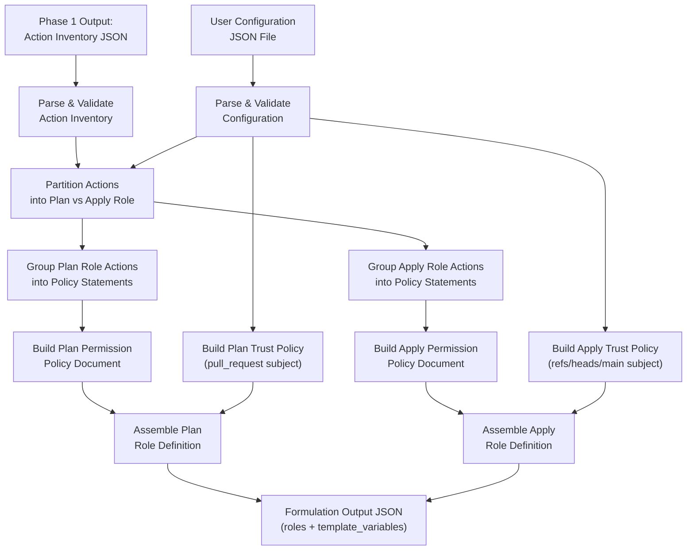
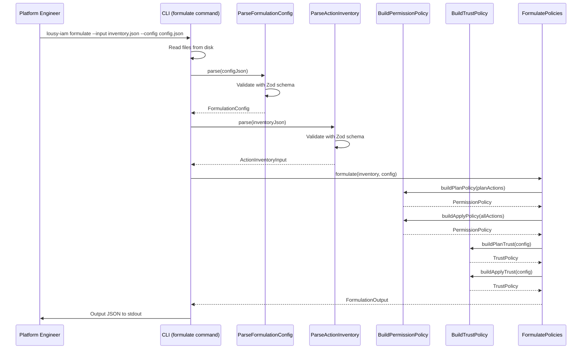

# Feature: Phase 2 — Policy Formulation

## Problem Statement

After Phase 1 produces an action inventory of required IAM actions from a Terraform plan, engineers need those actions transformed into valid, least-privileged AWS IAM policy documents. Manually constructing trust policies, permission policies, and role definitions with proper statement grouping, resource scoping, and OIDC configuration is tedious and error-prone. Phase 2 automates this transformation, producing candidate JSON policy documents split into plan and apply roles.

## Personas

| Persona | Impact | Notes |
|---------|--------|-------|
| Platform Engineer | Primary — uses the CLI to generate policy documents from action inventories | Needs correctly structured, deployable IAM policies |
| Security Engineer | Secondary — reviews generated policies for least-privilege compliance | Benefits from well-scoped statements with descriptive Sids |

## Value Assessment

- **Primary value**: Automation — transforms raw action lists into structured IAM policy JSON
- **Secondary value**: Security — enforces plan/apply role separation with correct OIDC trust
- **Tertiary value**: Consistency — produces templated policies that work across environments

## User Stories

### Story 1: Parse Formulation Configuration

As a **platform engineer**,
I want to **provide a configuration file with GitHub org, repo, and deployment settings**,
so that the **CLI can generate correctly scoped trust and permission policies**.

#### Acceptance Criteria

- When a user provides a valid JSON configuration file, the `CLI` shall parse and validate all required fields (`github_org`, `github_repo`, `resource_prefix`).
- If a required configuration field is missing, then the `CLI` shall display a validation error identifying the missing field.
- Where optional configuration fields are not provided, the `CLI` shall use default values (`plan_apply_separation: true`, `include_delete_actions: true`, `role_path: "/"`, `max_session_duration: 3600`).
- When `use_github_environments` is `true`, the `CLI` shall require `github_environment_names` to be a non-empty object.
- If the configuration file is not valid JSON, then the `CLI` shall display a descriptive parsing error.

### Story 2: Parse Action Inventory Input

As a **platform engineer**,
I want to **provide the Phase 1 action inventory JSON as input to policy formulation**,
so that the **CLI can use the analyzed actions to construct IAM policies**.

#### Acceptance Criteria

- When a user provides a valid Phase 1 action inventory JSON file, the `CLI` shall parse and extract metadata, toolchain actions, and infrastructure actions.
- If the action inventory JSON is missing required sections (`metadata`, `toolchain_actions`, `infrastructure_actions`), then the `CLI` shall display a validation error.
- When parsing the action inventory, the `CLI` shall preserve the `plan_and_apply` and `apply_only` action groupings from Phase 1.

### Story 3: Build Permission Policies

As a **platform engineer**,
I want the **CLI to group IAM actions into well-structured policy statements**,
so that I can **get readable, auditable permission policies with descriptive Sids**.

#### Acceptance Criteria

- When building permission policies, the `CLI` shall group actions into statements by service prefix (e.g., all `s3:*` actions share a statement).
- The `CLI` shall generate a plan role permission policy containing only `plan_and_apply` actions (read-only).
- The `CLI` shall generate an apply role permission policy containing all actions (`plan_and_apply` + `apply_only`).
- When `include_delete_actions` is `false`, the `CLI` shall exclude delete category actions from the apply role.
- Each policy statement shall include a descriptive `Sid` derived from the service name and action type.
- Each policy statement shall have `Effect` set to `"Allow"`.
- Each policy document shall include `"Version": "2012-10-17"`.
- The `CLI` shall estimate the serialized size of each policy document in bytes.

### Story 4: Build Trust Policies

As a **platform engineer**,
I want the **CLI to generate OIDC trust policies for GitHub Actions**,
so that the **plan and apply roles can be assumed by the correct CI/CD workflows**.

#### Acceptance Criteria

- When generating a plan role trust policy, the `CLI` shall set the `sub` condition to `repo:${org}/${repo}:pull_request`.
- When generating an apply role trust policy, the `CLI` shall set the `sub` condition to `repo:${org}/${repo}:ref:refs/heads/main`.
- While `use_github_environments` is enabled, the `CLI` shall use `repo:${org}/${repo}:environment:${github_environment_name}` as the apply role `sub` condition.
- The `CLI` shall always include an `aud` condition with value `sts.amazonaws.com`.
- The `CLI` shall use `sts:AssumeRoleWithWebIdentity` as the trust policy action.
- The `CLI` shall use `StringEquals` as the condition operator.
- The trust policy `Principal.Federated` shall reference the GitHub OIDC provider ARN with `${account_id}` template variable.

### Story 5: Assemble Role Definitions

As a **platform engineer**,
I want the **CLI to produce a complete JSON output with role definitions and template variables**,
so that I can **submit the output to the provisioning pipeline**.

#### Acceptance Criteria

- When `plan_apply_separation` is `true`, the `CLI` shall produce two role definitions: one for plan and one for apply.
- When `plan_apply_separation` is `false`, the `CLI` shall produce a single apply role definition containing all actions.
- Each role definition shall include `role_name`, `role_path`, `description`, `max_session_duration`, `permission_boundary_arn`, `trust_policy`, and `permission_policies`.
- The `CLI` shall include a `template_variables` section describing all placeholder variables used in the output.
- The `CLI` shall output the result as formatted JSON to stdout.

---

## Design

### Data Flow Diagram

### Sequence Diagram

### Components Affected

| Layer | Component | File | Purpose |
|-------|-----------|------|---------|
| Entity | FormulationConfig | `src/entities/formulation-config.ts` | TypeScript types for user configuration |
| Entity | PolicyDocument | `src/entities/policy-document.ts` | Types for IAM policy documents and role definitions |
| Use Case | FormulationConfigSchema | `src/use-cases/formulation-config.schema.ts` | Zod schema for config validation |
| Use Case | ActionInventorySchema | `src/use-cases/action-inventory.schema.ts` | Zod schema for Phase 1 output validation |
| Use Case | ParseFormulationConfig | `src/use-cases/parse-formulation-config.ts` | Parse and validate user configuration |
| Use Case | ParseActionInventory | `src/use-cases/parse-action-inventory.ts` | Parse and validate Phase 1 action inventory |
| Use Case | BuildPermissionPolicy | `src/use-cases/build-permission-policy.ts` | Group actions into statements, build policy documents |
| Use Case | BuildTrustPolicy | `src/use-cases/build-trust-policy.ts` | Generate OIDC trust policies |
| Use Case | FormulatePolicies | `src/use-cases/formulate-policies.ts` | Orchestrate policy formulation |
| Command | FormulateCommand | `src/commands/formulate.ts` | CLI command handler |
| Root | index.ts | `src/index.ts` | Wire formulate subcommand |

### Architecture Decisions

1. **Action inventory as file input**: Phase 2 reads the Phase 1 output from a JSON file rather than piping, enabling independent execution of each phase.
2. **Template variables as placeholders**: Account IDs, regions, and environment names are represented as `${variable}` placeholders in the output, allowing the same policy to work across environments.
3. **Service-based statement grouping**: Actions are grouped into policy statements by AWS service prefix for readability and auditability.

### Dependencies

- Runtime: No new runtime dependencies — uses existing `zod`, `citty`, `consola`.

---

## Tasks

### Task 1: Create Policy Document and Config Entity Types

**Objective**: Define TypeScript entity types for IAM policy documents, role definitions, and formulation configuration.

**Context**: The entity layer defines pure data structures for the Phase 2 input (user config) and output (policy documents, role definitions). These types enforce the structure of the formulation pipeline.

**Affected files**:
- `src/entities/formulation-config.ts` (new)
- `src/entities/policy-document.ts` (new)

**Requirements**: Supports Stories 1, 3, 4, 5.

**Verification**:
- [ ] `npm test` passes
- [ ] `npx biome check` passes
- [ ] `npm run build` passes

### Task 2: Create Formulation Config Schema and Parser

**Objective**: Implement Zod schema validation and parsing for user configuration input.

**Context**: The user provides a JSON config file with GitHub org/repo, resource prefix, and optional settings. The parser validates required fields and applies defaults for optional fields.

**Affected files**:
- `src/use-cases/formulation-config.schema.ts` (new)
- `src/use-cases/formulation-config.schema.test.ts` (new)
- `src/use-cases/parse-formulation-config.ts` (new)
- `src/use-cases/parse-formulation-config.test.ts` (new)

**Requirements**: Covers Story 1 acceptance criteria.

**Verification**:
- [ ] `npm test` passes
- [ ] `npx biome check` passes
- [ ] Schema validates well-formed config
- [ ] Schema rejects missing required fields with descriptive errors
- [ ] Defaults are applied for optional fields

### Task 3: Create Action Inventory Schema and Parser

**Objective**: Implement Zod schema validation and parsing for Phase 1 action inventory input.

**Context**: Phase 2 reads the Phase 1 output file. The parser validates the structure and extracts metadata, toolchain actions, and infrastructure actions.

**Affected files**:
- `src/use-cases/action-inventory.schema.ts` (new)
- `src/use-cases/action-inventory.schema.test.ts` (new)
- `src/use-cases/parse-action-inventory.ts` (new)
- `src/use-cases/parse-action-inventory.test.ts` (new)

**Requirements**: Covers Story 2 acceptance criteria.

**Verification**:
- [ ] `npm test` passes
- [ ] `npx biome check` passes
- [ ] Schema validates well-formed action inventory JSON
- [ ] Schema rejects missing sections with descriptive errors

### Task 4: Create Build Permission Policy Use Case

**Objective**: Implement the use case that groups actions into policy statements and builds permission policy documents.

**Context**: Actions are grouped by AWS service prefix into statements with descriptive Sids. The plan role gets only read actions, while the apply role gets all actions. Size estimation is performed on the serialized policy.

**Affected files**:
- `src/use-cases/build-permission-policy.ts` (new)
- `src/use-cases/build-permission-policy.test.ts` (new)

**Requirements**: Covers Story 3 acceptance criteria.

**Verification**:
- [ ] `npm test` passes
- [ ] `npx biome check` passes
- [ ] Actions grouped by service into statements
- [ ] Descriptive Sids generated
- [ ] Policy documents include Version 2012-10-17
- [ ] Size estimation calculated

### Task 5: Create Build Trust Policy Use Case

**Objective**: Implement the use case that generates OIDC trust policies for GitHub Actions.

**Context**: Plan role trusts `pull_request` subject, apply role trusts `ref:refs/heads/main` or environment-scoped subject. Both include audience condition and use `sts:AssumeRoleWithWebIdentity`.

**Affected files**:
- `src/use-cases/build-trust-policy.ts` (new)
- `src/use-cases/build-trust-policy.test.ts` (new)

**Requirements**: Covers Story 4 acceptance criteria.

**Verification**:
- [ ] `npm test` passes
- [ ] `npx biome check` passes
- [ ] Plan trust policy uses pull_request subject
- [ ] Apply trust policy uses ref:refs/heads/main subject
- [ ] GitHub Environments mode uses environment subject
- [ ] Audience condition always included

### Task 6: Create Formulate Policies Use Case and CLI Command

**Objective**: Implement the orchestration use case and CLI command that assembles complete role definitions.

**Context**: The formulate use case combines permission policies and trust policies into role definitions. The CLI command reads input files, invokes the use case, and outputs JSON.

**Affected files**:
- `src/use-cases/formulate-policies.ts` (new)
- `src/use-cases/formulate-policies.test.ts` (new)
- `src/commands/formulate.ts` (new)
- `src/commands/formulate.test.ts` (new)
- `src/index.ts` (modified)
- `src/index.test.ts` (modified)

**Requirements**: Covers Story 5 acceptance criteria and end-to-end CLI integration.

**Verification**:
- [ ] `npm test` passes
- [ ] `npx biome check` passes
- [ ] `npm run build` passes
- [ ] CLI outputs valid role definitions JSON
- [ ] Template variables section included in output
- [ ] Two roles generated when plan_apply_separation is true
- [ ] Single role generated when plan_apply_separation is false
