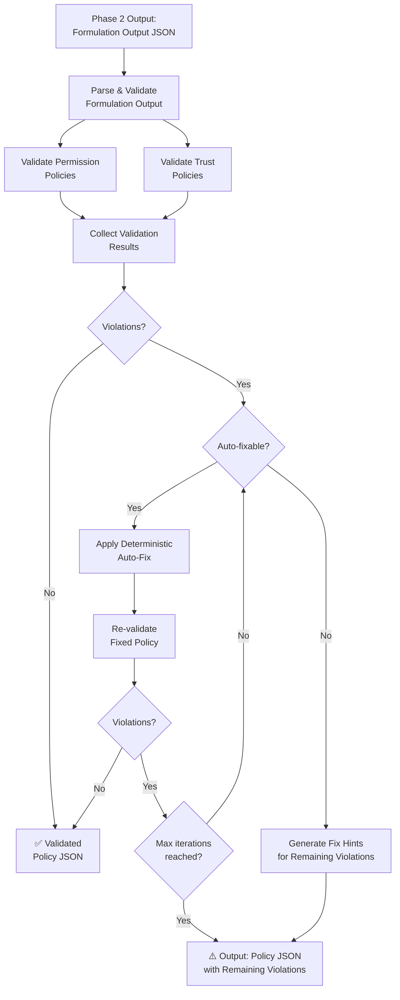
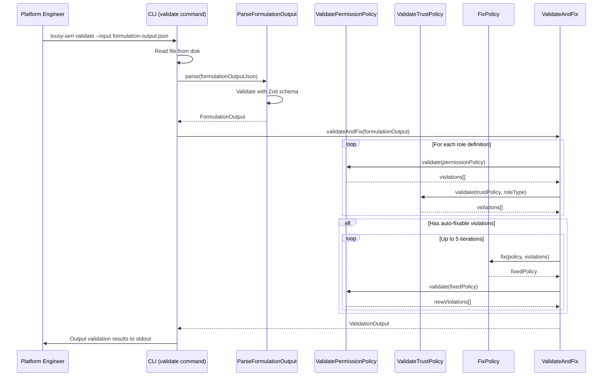

# Feature: Phase 3 — Validate & Fix

## Problem Statement

After Phase 2 produces candidate IAM policy documents (trust policies and permission policies), engineers need automated validation to ensure policies follow least-privilege best practices before submission to provisioning pipelines. Manually reviewing policies for wildcards, missing conditions, privilege escalation, and structural issues is error-prone. Phase 3 validates policies against 33 rules across 6 categories, auto-fixes 10 deterministic violations, and produces structured hints for remaining issues.

## Personas

| Persona | Impact | Notes |
|---------|--------|-------|
| Platform Engineer | Primary — runs validation on generated policies before deploying | Needs clean policies that pass security review |
| Security Engineer | Secondary — reviews validation results for compliance | Benefits from rule-based automated enforcement of least-privilege standards |

## Value Assessment

- **Primary value**: Security — enforces least-privilege best practices before deployment
- **Secondary value**: Automation — auto-fixes 10 deterministic violations without human intervention
- **Tertiary value**: Auditability — produces machine-readable validation results with rule IDs and fix hints

## User Stories

### Story 1: Validate Permission Policy Actions

As a **platform engineer**,
I want the **CLI to check permission policy actions for wildcards and deny-listed patterns**,
so that **generated policies never include overly broad or dangerous actions**.

#### Acceptance Criteria

- When a permission policy contains `"Action": "*"`, the `CLI` shall report an `LP-001` error violation.
- When a permission policy contains a service-level wildcard action (e.g., `"s3:*"`), the `CLI` shall report an `LP-002` error violation.
- When a permission policy uses `NotAction`, the `CLI` shall report an `LP-003` warning.
- When a permission policy contains deny-listed actions (`organizations:*`, `account:*`, `iam:CreateUser`, `iam:CreateAccessKey`, `iam:CreateLoginProfile`, unscoped `sts:AssumeRole`), the `CLI` shall report an `LP-004` error violation.
- When a permission policy contains overly broad actions (`ec2:*`, `s3:*`, `lambda:*`), the `CLI` shall report an `LP-005` warning.

### Story 2: Validate Resource Scoping

As a **security engineer**,
I want the **CLI to detect `Resource: "*"` on actions that support resource-level permissions**,
so that **policies are scoped to specific resources wherever possible**.

#### Acceptance Criteria

- When a statement has `Resource: "*"` and the action supports resource-level permissions (not in the unscoped actions allowlist), the `CLI` shall report an `LP-010` error violation.
- When a statement has `Resource: "*"` on an unscoped action, the `CLI` shall report an `LP-011` warning encouraging conditions.
- When a resource ARN hardcodes an account ID, the `CLI` shall report an `LP-012` error violation.
- When a resource ARN has only `*` in the resource segment with no conditions, the `CLI` shall report an `LP-013` warning.

### Story 3: Validate Condition Requirements

As a **security engineer**,
I want the **CLI to enforce required conditions on sensitive IAM actions**,
so that **iam:PassRole, iam:CreateRole, and similar actions are properly scoped**.

#### Acceptance Criteria

- When `iam:PassRole` has `Resource: "*"`, the `CLI` shall report an `LP-020` error violation.
- When `iam:PassRole` lacks an `iam:PassedToService` condition, the `CLI` shall report an auto-fixable `LP-021` error violation.
- When `iam:CreateRole` is present and a permissions boundary is configured but no `iam:PermissionsBoundary` condition exists, the `CLI` shall report an `LP-022` error violation.
- When `iam:CreateServiceLinkedRole` lacks an `iam:AWSServiceName` condition, the `CLI` shall report an auto-fixable `LP-023` error violation.
- When `Resource: "*"` is used on a region-scoped service without an `aws:RequestedRegion` condition, the `CLI` shall report an auto-fixable `LP-024` warning.
- When a resource creation action lacks `aws:RequestTag` conditions and mandatory tags are configured, the `CLI` shall report an auto-fixable `LP-025` warning.

### Story 4: Validate Trust Policy

As a **platform engineer**,
I want the **CLI to validate trust policies for correct OIDC configuration**,
so that **only authorized GitHub Actions workflows can assume the IAM roles**.

#### Acceptance Criteria

- When a trust policy does not use `sts:AssumeRoleWithWebIdentity`, the `CLI` shall report an `LP-030` error violation.
- When a trust policy lacks an `aud` condition with `sts.amazonaws.com`, the `CLI` shall report an auto-fixable `LP-031` error violation.
- When a trust policy lacks a `sub` condition, the `CLI` shall report an `LP-032` error violation.
- When a trust policy `sub` condition uses an org-wide wildcard, the `CLI` shall report an `LP-033` error violation.
- When a trust policy uses `StringLike` where no wildcards are present, the `CLI` shall report an auto-fixable `LP-034` warning.
- When a plan role trust policy does not use a `pull_request` subject, the `CLI` shall report an `LP-035` error violation.
- When an apply role trust policy does not use `ref:refs/heads/main` or `environment:<name>` subject, the `CLI` shall report an `LP-036` error violation.

### Story 5: Validate Policy Structure

As a **platform engineer**,
I want the **CLI to validate policy structure requirements**,
so that **policies are valid, readable, and within AWS limits**.

#### Acceptance Criteria

- When a policy document lacks `"Version": "2012-10-17"`, the `CLI` shall report an auto-fixable `LP-040` error violation.
- When a statement lacks an explicit `Sid`, the `CLI` shall report an auto-fixable `LP-041` error violation.
- When a policy document exceeds 6,144 bytes, the `CLI` shall report an `LP-042` error violation.
- When a statement contains more than 20 actions, the `CLI` shall report an `LP-043` warning.
- When a role has more than 10 managed policies, the `CLI` shall report an `LP-044` warning.
- When a statement contains duplicate actions, the `CLI` shall report an auto-fixable `LP-045` error violation.
- When duplicate actions appear across statements, the `CLI` shall report an auto-fixable `LP-046` warning.

### Story 6: Validate Privilege Escalation Prevention

As a **security engineer**,
I want the **CLI to detect privilege escalation patterns**,
so that **deployment roles cannot modify their own permissions**.

#### Acceptance Criteria

- When `iam:PutRolePolicy` or `iam:AttachRolePolicy` targets the deployment role's own ARN, the `CLI` shall report an `LP-050` error violation.
- When `iam:CreatePolicyVersion` targets the deployment role's own policies, the `CLI` shall report an `LP-051` error violation.
- When `iam:CreateRole` is present and `iam:PassRole` is not scoped to only created roles, the `CLI` shall report an `LP-052` error violation.
- When `iam:Put*Policy` or `iam:Attach*Policy` is used without resource scoping, the `CLI` shall report an `LP-053` warning.

### Story 7: Auto-Fix Deterministic Violations

As a **platform engineer**,
I want the **CLI to automatically fix deterministic violations**,
so that **I can get compliant policies without manual intervention for known patterns**.

#### Acceptance Criteria

- When `LP-021` is violated, the `CLI` shall auto-fix by adding `iam:PassedToService` condition using the pass role targets lookup.
- When `LP-023` is violated, the `CLI` shall auto-fix by adding `iam:AWSServiceName` condition using the service linked roles lookup.
- When `LP-024` is violated, the `CLI` shall auto-fix by adding `aws:RequestedRegion` condition.
- When `LP-025` is violated, the `CLI` shall auto-fix by adding `aws:RequestTag` conditions for mandatory tags.
- When `LP-031` is violated, the `CLI` shall auto-fix by adding `aud` condition with `sts.amazonaws.com`.
- When `LP-034` is violated, the `CLI` shall auto-fix by replacing `StringLike` with `StringEquals` when no wildcards are present.
- When `LP-040` is violated, the `CLI` shall auto-fix by adding `"Version": "2012-10-17"`.
- When `LP-041` is violated, the `CLI` shall auto-fix by generating a `Sid` from the action group.
- When `LP-045` is violated, the `CLI` shall auto-fix by deduplicating actions within the statement.
- When `LP-046` is violated, the `CLI` shall auto-fix by removing duplicate actions from the less specific statement.

### Story 8: Fix Loop Orchestration

As a **platform engineer**,
I want the **CLI to iteratively validate and fix policies up to a maximum number of cycles**,
so that **auto-fixes do not loop indefinitely and I get the best possible result**.

#### Acceptance Criteria

- When violations are found, the `CLI` shall apply auto-fixes and re-validate up to 5 iterations.
- If no violations remain after a fix cycle, the `CLI` shall output validated policy JSON.
- If the maximum iteration count is reached, the `CLI` shall output policy JSON with remaining violations annotated.
- When the same set of violations appears in consecutive iterations (oscillation), the `CLI` shall halt with an error.
- The `CLI` shall log each iteration's changes for auditability.

---

## Design

### Data Flow Diagram

### Sequence Diagram

### Components Affected

| Layer | Component | File | Purpose |
|-------|-----------|------|---------|
| Entity | ValidationResult | `src/entities/validation-result.ts` | Types for validation violations and results |
| Use Case | FormulationOutputSchema | `src/use-cases/formulation-output.schema.ts` | Zod schema for Phase 2 output validation |
| Use Case | ParseFormulationOutput | `src/use-cases/parse-formulation-output.ts` | Parse and validate Phase 2 output |
| Use Case | ValidatePermissionPolicy | `src/use-cases/validate-permission-policy.ts` | Permission policy validation rules (Categories 1-3, 5-6) |
| Use Case | ValidateTrustPolicy | `src/use-cases/validate-trust-policy.ts` | Trust policy validation rules (Category 4) |
| Use Case | FixPolicy | `src/use-cases/fix-policy.ts` | Auto-fix logic for 10 deterministic rules |
| Use Case | ValidateAndFix | `src/use-cases/validate-and-fix.ts` | Fix loop orchestrator |
| Command | ValidateCommand | `src/commands/validate.ts` | CLI command handler |
| Root | index.ts | `src/index.ts` | Wire validate subcommand |

### Architecture Decisions

1. **TypeScript validation engine**: Validation rules are implemented as pure TypeScript functions rather than OPA/WASM, maintaining zero external dependencies and consistent toolchain. Each rule returns a structured violation object matching the spec's schema.
2. **Stateless rule functions**: Each LP-xxx rule is a pure function that takes a policy document and returns violations, enabling independent testing and composition.
3. **Immutable fix application**: Auto-fixes create new policy objects rather than mutating in place, preventing side effects and supporting the fix loop's oscillation detection.
4. **Unscoped actions as configuration**: The allowlist of actions that legitimately require `Resource: "*"` is defined as a configuration set, matching the action mapping database pattern.

### Dependencies

- Runtime: No new runtime dependencies — uses existing `zod`, `citty`, `consola`.

---

## Tasks

### Task 1: Create Validation Result Entity Types

**Objective**: Define TypeScript entity types for validation violations, results, and statistics.

**Context**: The entity layer defines pure data structures for validation output. These types are used throughout Phase 3 for representing rule violations, fix hints, and summary statistics.

**Affected files**:
- `src/entities/validation-result.ts` (new)

**Requirements**: Supports all Stories.

**Verification**:
- [ ] `npm test` passes
- [ ] `npx biome check` passes
- [ ] `npm run build` passes

### Task 2: Create Formulation Output Schema and Parser

**Objective**: Implement Zod schema validation for Phase 2 output, enabling the validate command to accept formulation output JSON as input.

**Context**: The validate command reads Phase 2 output containing role definitions with trust policies and permission policies. This parser validates the structure before passing it to validation rules.

**Affected files**:
- `src/use-cases/formulation-output.schema.ts` (new)
- `src/use-cases/formulation-output.schema.test.ts` (new)
- `src/use-cases/parse-formulation-output.ts` (new)
- `src/use-cases/parse-formulation-output.test.ts` (new)

**Requirements**: Supports Story 8.

**Verification**:
- [ ] `npm test` passes
- [ ] `npx biome check` passes
- [ ] Schema validates well-formed Phase 2 output
- [ ] Schema rejects malformed input with descriptive errors

### Task 3: Create Permission Policy Validator

**Objective**: Implement validation rules for permission policies covering action scoping, resource scoping, condition requirements, policy structure, and privilege escalation prevention.

**Context**: This use case implements LP-001 through LP-053 (excluding trust policy rules LP-030 through LP-036). Each rule is a pure function that inspects a policy document and returns violations.

**Affected files**:
- `src/use-cases/validate-permission-policy.ts` (new)
- `src/use-cases/validate-permission-policy.test.ts` (new)

**Requirements**: Covers Stories 1, 2, 3, 5, 6.

**Verification**:
- [ ] `npm test` passes
- [ ] `npx biome check` passes
- [ ] All 26 permission policy rules produce correct violations
- [ ] Rules return empty arrays for compliant policies

### Task 4: Create Trust Policy Validator

**Objective**: Implement validation rules for trust policies covering OIDC configuration and subject scoping.

**Context**: Trust policy validation implements LP-030 through LP-036. Rules validate OIDC provider configuration, audience conditions, and subject scoping for plan vs apply roles.

**Affected files**:
- `src/use-cases/validate-trust-policy.ts` (new)
- `src/use-cases/validate-trust-policy.test.ts` (new)

**Requirements**: Covers Story 4.

**Verification**:
- [ ] `npm test` passes
- [ ] `npx biome check` passes
- [ ] All 7 trust policy rules produce correct violations
- [ ] Plan role subject validation works correctly
- [ ] Apply role subject validation works correctly

### Task 5: Create Auto-Fix Logic

**Objective**: Implement deterministic auto-fix functions for 10 auto-fixable rules.

**Context**: Auto-fixes are deterministic transformations that modify policy documents to resolve specific violations. Each fix creates a new policy document (immutable) and is idempotent.

**Affected files**:
- `src/use-cases/fix-policy.ts` (new)
- `src/use-cases/fix-policy.test.ts` (new)

**Requirements**: Covers Story 7.

**Verification**:
- [ ] `npm test` passes
- [ ] `npx biome check` passes
- [ ] All 10 auto-fix rules produce correct results
- [ ] Fixes are idempotent (applying twice yields same result)

### Task 6: Create Validate-and-Fix Orchestrator

**Objective**: Implement the fix loop that iteratively validates, fixes, and re-validates policies up to a maximum iteration count.

**Context**: The orchestrator coordinates validators and fixers, detecting oscillation and enforcing the iteration limit. It produces a final validation output with either clean policies or remaining violations.

**Affected files**:
- `src/use-cases/validate-and-fix.ts` (new)
- `src/use-cases/validate-and-fix.test.ts` (new)

**Requirements**: Covers Story 8.

**Verification**:
- [ ] `npm test` passes
- [ ] `npx biome check` passes
- [ ] Clean policies pass through with no changes
- [ ] Auto-fixable violations are resolved in fix loop
- [ ] Oscillation detection halts the loop
- [ ] Max iteration limit is enforced

### Task 7: Create Validate Command and Wire Up

**Objective**: Implement the CLI command handler for the validate subcommand and register it in the composition root.

**Context**: The validate command reads a Phase 2 output file, runs validation and auto-fix, and outputs results to stdout. It follows the same pattern as the existing formulate command.

**Affected files**:
- `src/commands/validate.ts` (new)
- `src/commands/validate.test.ts` (new)
- `src/index.ts` (modified)

**Requirements**: Covers all Stories.

**Verification**:
- [ ] `npm test` passes
- [ ] `npx biome check` passes
- [ ] `npm run build` passes
- [ ] Validate command is registered as a subcommand
- [ ] Command accepts `--input` argument
- [ ] Command outputs validation results to stdout
