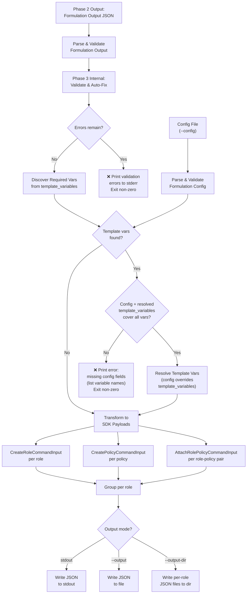
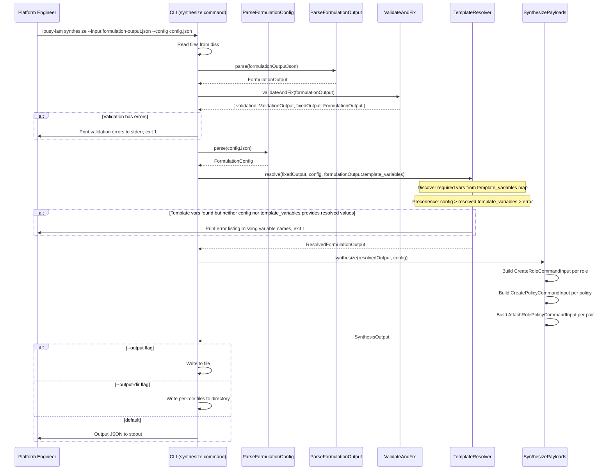

# Feature: Phase 4 — Synthesize

## Problem Statement

After Phase 2 produces candidate IAM policy documents and Phase 3 validates and auto-fixes them, platform engineers need to transform these policies into payloads compatible with the AWS JavaScript SDK v3. Currently, the pipeline outputs internal data structures that require manual translation into `CreatePolicyCommand`, `CreateRoleCommand`, and `AttachRolePolicyCommand` inputs. This manual step is error-prone and breaks the automation chain. Phase 4 synthesizes validated policies into SDK-ready JSON payloads that can be used directly with `@aws-sdk/client-iam`.

## Personas

| Persona | Impact | Notes |
|---------|--------|-------|
| Platform Engineer | Primary — runs synthesis to produce deployment-ready IAM payloads | Needs SDK-compatible output for infrastructure automation scripts |
| DevOps Engineer | Secondary — integrates synthesized output into CI/CD pipelines | Benefits from machine-readable, ordered payloads that map directly to SDK calls |

## Value Assessment

- **Primary value**: Automation — closes the gap between policy generation and IAM provisioning
- **Secondary value**: Correctness — ensures generated payloads match exact AWS SDK v3 input schemas
- **Tertiary value**: Safety — refuses to synthesize policies that fail validation, preventing insecure deployments

## User Stories

### Story 1: Synthesize CreateRoleCommand Payloads

As a **platform engineer**,
I want the **CLI to transform role definitions into `CreateRoleCommandInput` payloads**,
so that I can **create IAM roles using the AWS JavaScript SDK v3 without manual translation**.

#### Acceptance Criteria

- When the `synthesize` command receives valid formulation output, the `CLI` shall produce a `CreateRoleCommandInput` payload for each role definition.
- The `CLI` shall set `RoleName` from the role definition's `role_name`.
- The `CLI` shall set `AssumeRolePolicyDocument` to the JSON-stringified trust policy document.
- The `CLI` shall normalize the role definition's `role_path` so that it starts and ends with `/` before using it in any payload or ARN computation. A single `/` represents the root path. For example, `deployment` becomes `/deployment/`, `/deployment` becomes `/deployment/`, and `/` remains `/`.
- The `CLI` shall set `Path` from the normalized `role_path`.
- The `CLI` shall set `Description` from the role definition's `description`.
- The `CLI` shall set `MaxSessionDuration` from the role definition's `max_session_duration`.
- Where `permission_boundary_arn` is not null, the `CLI` shall set `PermissionsBoundary` to the permission boundary ARN.
- Where `permission_boundary_arn` is null, the `CLI` shall omit the `PermissionsBoundary` field from the payload.

### Story 2: Synthesize CreatePolicyCommand Payloads

As a **platform engineer**,
I want the **CLI to transform permission policies into `CreatePolicyCommandInput` payloads**,
so that I can **create IAM managed policies using the AWS JavaScript SDK v3**.

#### Acceptance Criteria

- When the `synthesize` command receives valid formulation output, the `CLI` shall produce a `CreatePolicyCommandInput` payload for each permission policy in each role.
- The `CLI` shall set `PolicyName` from the permission policy's `policy_name`.
- The `CLI` shall set `PolicyDocument` to the JSON-stringified permission policy document.
- The `CLI` shall set `Path` from the normalized `role_path` (see Story 1 normalization rule).
- The `CLI` shall set `Description` to a generated description referencing the role name (e.g., `"Permission policy for role <role_name>"`).

### Story 3: Synthesize AttachRolePolicyCommand Payloads

As a **platform engineer**,
I want the **CLI to produce `AttachRolePolicyCommandInput` payloads linking roles to their policies**,
so that I can **attach managed policies to roles using the AWS JavaScript SDK v3**.

#### Acceptance Criteria

- When the `synthesize` command receives valid formulation output, the `CLI` shall produce an `AttachRolePolicyCommandInput` payload for each role-policy pair.
- The `CLI` shall set `RoleName` from the role definition's `role_name`.
- The `CLI` shall generate `PolicyArn` using the pattern `arn:{partition}:iam::{account_id}:policy{normalized_path}{policy_name}`, where `{normalized_path}` is the `role_path` after applying the Story 1 normalization rule (ensuring leading and trailing `/`).
- The `CLI` shall derive the partition from the config's `region` field using the existing `resolvePartition` logic (`aws`, `aws-us-gov`, `aws-cn`).

### Story 4: Resolve Template Variables

As a **platform engineer**,
I want the **CLI to resolve `${account_id}` and other template variable placeholders in the synthesized output**,
so that **the payloads are ready to use without manual string replacement**.

#### Acceptance Criteria

- The `CLI` shall use the formulation output's `template_variables` map as the authoritative manifest of which template variables exist in the generated policies.
- When resolving template variables, the `CLI` shall apply the following precedence (highest to lowest): (1) values from the `--config` file, (2) values from `formulationOutput.template_variables` that are valid resolved values (not descriptive placeholders).
- The `CLI` shall treat a `template_variables` value as a descriptive placeholder (not a resolved value) when it does not match the expected format for that variable (e.g., `account_id` values must be a 12-digit string, `region` values must match an AWS region pattern). Descriptive placeholders like `"Target AWS account ID"` shall not be used as resolved values.
- When the formulation output contains `${account_id}` placeholders and the config file provides `account_id`, the `CLI` shall replace all occurrences with the resolved value.
- When the `CLI` discovers required template variables via `template_variables` that have only descriptive placeholder values and the config file does not provide the required values, then the `CLI` shall print an error message listing the missing variables (by key name) and explaining that they must be supplied in the config file.
- If the config file does not contain `account_id` and the formulation output contains `${account_id}` placeholders, then the `CLI` shall exit with a non-zero exit code.
- The `CLI` shall resolve template variables in all string fields of the synthesized output, including ARNs in trust policies, resource ARNs in permission policies, and generated `PolicyArn` values.
- When `template_variables` and `--config` both provide a resolved value for the same variable, the `CLI` shall use the `--config` value.

### Story 5: Validate Before Synthesizing

As a **security engineer**,
I want the **CLI to run validation and auto-fix internally before generating SDK payloads**,
so that **only policies that pass all security rules are synthesized into deployment-ready payloads**.

#### Acceptance Criteria

- When the `synthesize` command receives formulation output, the `CLI` shall run the Phase 3 validate-and-fix orchestrator internally before generating payloads.
- If validation finds errors that cannot be auto-fixed, then the `CLI` shall print the validation results to stderr and exit with a non-zero exit code.
- If validation finds only warnings (no errors), the `CLI` shall proceed with synthesis and log the warnings to stderr.
- The `CLI` shall use the auto-fixed policies (not the original input) as the basis for the synthesized payloads. This requires extending the Phase 3 `ValidateAndFixOrchestrator.execute()` return type to include the fixed `FormulationOutput` alongside the existing `ValidationOutput`, since the current implementation only returns validation results.

### Story 6: Output Modes

As a **platform engineer**,
I want the **CLI to support multiple output modes (stdout, single file, directory)**,
so that I can **integrate the synthesized output into different workflow styles**.

#### Acceptance Criteria

- When no output flags are provided, the `CLI` shall write the synthesized JSON to stdout.
- When `--output <path>` is provided, the `CLI` shall write the full synthesized JSON to the specified file path.
- When `--output-dir <path>` is provided, the `CLI` shall write individual JSON files per role to the specified directory.
- While `--output-dir` is active, the `CLI` shall name files using the pattern `{role_name}.json`.
- If `--output-dir` is provided and the directory does not exist, then the `CLI` shall create the directory.
- If both `--output` and `--output-dir` are provided, then the `CLI` shall print an error explaining that the flags are mutually exclusive.

---

## Design

### Output Schema

The synthesized output uses per-role groupings. Each role contains its `CreateRoleCommand` payload, associated `CreatePolicyCommand` payloads, and `AttachRolePolicyCommand` payloads:

```json
{
  "roles": [
    {
      "create_role": {
        "RoleName": "myteam-github-plan",
        "AssumeRolePolicyDocument": "{\"Version\":\"2012-10-17\",\"Statement\":[...]}",
        "Path": "/",
        "Description": "GitHub Actions plan role for myteam",
        "MaxSessionDuration": 3600
      },
      "create_policies": [
        {
          "PolicyName": "myteam-github-plan-permissions",
          "PolicyDocument": "{\"Version\":\"2012-10-17\",\"Statement\":[...]}",
          "Path": "/",
          "Description": "Permission policy for role myteam-github-plan"
        }
      ],
      "attach_role_policies": [
        {
          "RoleName": "myteam-github-plan",
          "PolicyArn": "arn:aws:iam::123456789012:policy/myteam-github-plan-permissions"
        }
      ]
    }
  ]
}
```

Note: `PolicyDocument` and `AssumeRolePolicyDocument` are JSON-stringified strings, matching the AWS SDK v3 input schema where these fields accept `string`, not objects.

### Data Flow Diagram



### Sequence Diagram



### Components Affected

| Layer | Component | File | Purpose |
|-------|-----------|------|---------|
| Entity | SynthesisOutput | `src/entities/synthesis-output.ts` (new) | Types for SDK payloads and synthesis result |
| Use Case | ResolveTemplateVariables | `src/use-cases/resolve-template-variables.ts` (new) | Replace `${...}` placeholders using config values |
| Use Case | SynthesizePayloads | `src/use-cases/synthesize-payloads.ts` (new) | Transform validated formulation output to SDK payloads |
| Use Case | SynthesisOutputSchema | `src/use-cases/synthesis-output.schema.ts` (new) | Zod schema for synthesis output validation |
| Command | SynthesizeCommand | `src/commands/synthesize.ts` (new) | CLI command handler |
| Root | index.ts | `src/index.ts` (modified) | Wire synthesize subcommand |
| Use Case | ValidateAndFix | `src/use-cases/validate-and-fix.ts` (modified) | Extended to return both `ValidationOutput` and fixed `FormulationOutput` for pre-synthesis validation |
| Use Case | ParseFormulationOutput | `src/use-cases/parse-formulation-output.ts` (existing) | Reused for input parsing |
| Use Case | ParseFormulationConfig | `src/use-cases/parse-formulation-config.ts` (existing) | Reused for config parsing |

### Architecture Decisions

1. **Internal validation gate**: Synthesis runs Phase 3 validate-and-fix internally rather than requiring a separate pipeline step. This guarantees that only valid, auto-fixed policies become SDK payloads, preventing insecure deployments even if the user skips the standalone `validate` command.
2. **Template variable resolution as a separate use case**: Extracting template resolution into its own use case keeps the synthesizer focused on data transformation and allows template resolution to be tested independently.
3. **Per-role output grouping**: Grouping payloads by role (rather than by operation type) maps naturally to how engineers deploy IAM resources — one role at a time — and simplifies directory output mode.
4. **JSON-stringified policy documents**: `CreatePolicyCommand` and `CreateRoleCommand` accept policy documents as JSON strings (not objects). The synthesizer applies `JSON.stringify` during transformation, matching the exact AWS SDK v3 contract.
5. **Predictable Policy ARN generation**: `AttachRolePolicyCommand` requires a `PolicyArn`. Since the policy hasn't been created yet at synthesis time, the synthesizer generates a deterministic ARN using `arn:{partition}:iam::{account_id}:policy{normalized_path}{policy_name}`, which is the ARN AWS will assign when the policy is created.
6. **Partition resolution reuse**: The synthesizer reuses the existing `resolvePartition` logic (from `build-trust-policy.ts`) to derive the correct AWS partition from the config's region field. This function should be extracted to a shared utility in `src/lib/`.
7. **Path normalization**: AWS IAM requires that `Path` values start and end with `/`, with `/` as the root. The synthesizer normalizes `role_path` before using it in `Path` fields and ARN generation. This prevents malformed ARNs such as `policy/deploymentmy-policy` when a path lacks a trailing slash. Normalization is applied once, early in the synthesis flow, and the normalized value is used consistently across `CreateRoleCommandInput.Path`, `CreatePolicyCommandInput.Path`, and `AttachRolePolicyCommandInput.PolicyArn`.
8. **Template variable precedence and discovery**: The formulation output's `template_variables` map is the authoritative manifest of which placeholders exist. During resolution, config values take highest precedence, followed by resolved values already present in `template_variables` (validated by format — e.g., 12-digit string for `account_id`, AWS region pattern for `region`). Descriptive placeholder text (e.g., `"Target AWS account ID"`) is never used as a resolved value. This two-source strategy avoids requiring users to re-specify values that Phase 2 already resolved while ensuring config always wins on conflict.

### Dependencies

- Runtime: No new runtime dependencies — uses existing `zod`, `citty`, `consola`.
- The `resolvePartition` function from `src/use-cases/build-trust-policy.ts` needs to be extracted to `src/lib/resolve-partition.ts` for shared use.

---

## Tasks

### Task 1: Extract resolvePartition to Shared Utility

**Objective**: Move the `resolvePartition` function from `build-trust-policy.ts` to `src/lib/resolve-partition.ts` so that both the trust policy builder and the synthesizer can use it.

**Context**: The synthesizer needs to determine the AWS partition (aws, aws-us-gov, aws-cn) from the config's region field to generate correct Policy ARNs. This logic already exists in `build-trust-policy.ts` but is not exported.

**Affected files**:
- `src/lib/resolve-partition.ts` (new)
- `src/lib/resolve-partition.test.ts` (new)
- `src/use-cases/build-trust-policy.ts` (modified — import from shared util)

**Requirements**: Supports Story 3.

**Verification**:
- [ ] `npm test` passes
- [ ] `npx biome check` passes
- [ ] `npm run build` passes
- [ ] Existing trust policy builder tests still pass after refactor

### Task 2: Create Synthesis Output Entity Types

**Objective**: Define TypeScript entity types for the synthesized SDK payloads.

**Context**: The entity layer defines pure data structures matching the AWS SDK v3 input interfaces for `CreateRoleCommandInput`, `CreatePolicyCommandInput`, and `AttachRolePolicyCommandInput`. These types are used throughout Phase 4.

**Affected files**:
- `src/entities/synthesis-output.ts` (new)

**Requirements**: Supports Stories 1, 2, 3.

**Verification**:
- [ ] `npm test` passes
- [ ] `npx biome check` passes
- [ ] `npm run build` passes

### Task 3: Create Template Variable Resolver

**Objective**: Implement a use case that replaces `${...}` template variable placeholders in the formulation output using values from the configuration file.

**Context**: The formulation output contains a `template_variables` map that serves as the authoritative manifest of which `${...}` placeholders exist in generated policies. Values in this map may be actual resolved values (e.g., `"123456789012"`) or descriptive placeholders (e.g., `"Target AWS account ID"`). The resolver must: (1) use `template_variables` to discover which variables need resolution, (2) apply precedence (config > resolved template_variables values > error for descriptive-only placeholders), (3) validate that template_variables values look like real values before using them (e.g., 12-digit string for account_id, AWS region pattern for region), and (4) replace all `${...}` occurrences. If required values are missing from both sources, it must produce a descriptive error listing the missing variable names.

**Affected files**:
- `src/use-cases/resolve-template-variables.ts` (new)
- `src/use-cases/resolve-template-variables.test.ts` (new)

**Requirements**: Supports Story 4.

**Verification**:
- [ ] `npm test` passes
- [ ] `npx biome check` passes
- [ ] Template variables in OIDC provider ARNs are resolved
- [ ] Template variables in resource ARNs are resolved
- [ ] Config values take precedence over template_variables values
- [ ] Resolved values in template_variables are used when config omits the variable
- [ ] Descriptive placeholder values in template_variables are not used as resolved values
- [ ] Missing config values produce descriptive errors listing variable names
- [ ] Output with no template variables passes through unchanged

### Task 4: Create Synthesize Payloads Use Case

**Objective**: Implement the core transformation from validated, resolved formulation output to AWS SDK v3 payloads.

**Context**: This use case takes a `FormulationOutput` (after validation and template resolution) and produces `CreateRoleCommandInput`, `CreatePolicyCommandInput`, and `AttachRolePolicyCommandInput` payloads grouped by role. Policy documents must be JSON-stringified. Policy ARNs must be generated using the deterministic pattern.

**Affected files**:
- `src/use-cases/synthesize-payloads.ts` (new)
- `src/use-cases/synthesize-payloads.test.ts` (new)

**Requirements**: Supports Stories 1, 2, 3.

**Verification**:
- [ ] `npm test` passes
- [ ] `npx biome check` passes
- [ ] `CreateRoleCommandInput` payloads match AWS SDK v3 schema
- [ ] `CreatePolicyCommandInput` payloads match AWS SDK v3 schema
- [ ] `AttachRolePolicyCommandInput` payloads match AWS SDK v3 schema
- [ ] `PolicyDocument` and `AssumeRolePolicyDocument` are JSON strings, not objects
- [ ] `PermissionsBoundary` is omitted when null
- [ ] `PolicyArn` follows the `arn:{partition}:iam::{account_id}:policy{normalized_path}{policy_name}` pattern
- [ ] `role_path` is normalized to start and end with `/` before use in `Path` and ARN fields
- [ ] Root path `/` remains `/` after normalization
- [ ] Paths missing leading or trailing `/` are corrected (e.g., `deployment` → `/deployment/`)

### Task 5: Create Synthesis Output Schema

**Objective**: Implement a Zod schema for the synthesis output to validate the structure of generated payloads.

**Context**: The output schema ensures the synthesizer produces well-formed payloads. It also serves as documentation of the exact output contract.

**Affected files**:
- `src/use-cases/synthesis-output.schema.ts` (new)
- `src/use-cases/synthesis-output.schema.test.ts` (new)

**Requirements**: Supports Stories 1, 2, 3, 6.

**Verification**:
- [ ] `npm test` passes
- [ ] `npx biome check` passes
- [ ] Schema validates well-formed synthesis output
- [ ] Schema rejects malformed output with descriptive errors

### Task 6: Create Synthesize Command and Wire Up

**Objective**: Implement the CLI command handler for the `synthesize` subcommand with support for stdout, `--output`, and `--output-dir` modes.

**Context**: The synthesize command orchestrates the full flow: parse input → validate+auto-fix → check config for template variables → resolve templates → synthesize payloads → output. It follows the same DI pattern as existing commands (`formulate`, `validate`).

**Affected files**:
- `src/commands/synthesize.ts` (new)
- `src/commands/synthesize.test.ts` (new)
- `src/index.ts` (modified — register synthesize subcommand)

**Requirements**: Supports Stories 5, 6.

**Verification**:
- [ ] `npm test` passes
- [ ] `npx biome check` passes
- [ ] `npm run build` passes
- [ ] `synthesize` command is registered as a subcommand
- [ ] Command accepts `--input` and `--config` arguments
- [ ] Command accepts optional `--output` and `--output-dir` arguments
- [ ] `--output` and `--output-dir` are mutually exclusive
- [ ] Default output goes to stdout
- [ ] `--output` writes to the specified file
- [ ] `--output-dir` writes per-role JSON files to the directory
- [ ] Validation errors cause non-zero exit with errors on stderr
- [ ] Missing template variable config values cause non-zero exit with descriptive error

### Task 7: Documentation

**Objective**: Create documentation for the synthesize command and update the getting-started guide.

**Context**: Documentation helps users understand the new command, its inputs/outputs, and how it fits into the overall pipeline.

**Affected files**:
- `docs/synthesize-command.md` (new)
- `docs/getting-started.md` (modified — add Phase 4 to pipeline overview)
- `docs/configuration.md` (modified — note `account_id` requirement for synthesis)

**Requirements**: Supports all Stories.

**Verification**:
- [ ] Documentation accurately describes command usage
- [ ] Examples show all three output modes
- [ ] Configuration requirements for synthesis are documented
