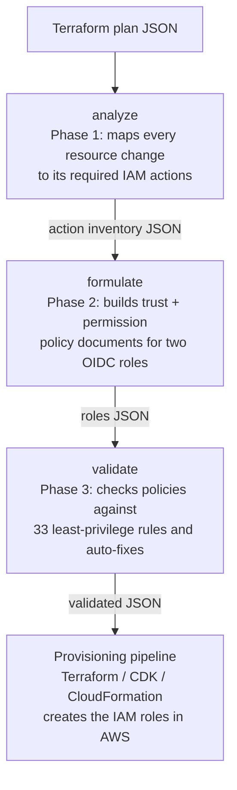

# lousy-iam Documentation

lousy-iam generates least-privilege AWS IAM policy documents from Terraform plan JSON for GitHub Actions deployment pipelines — without ever touching AWS directly.

## Table of Contents

- [Why lousy-iam?](#why-lousy-iam)
- [How It Works](#how-it-works)
- [Feature Highlights](#feature-highlights)
- [Getting Started](./getting-started.md)
- [Command Reference](#command-reference)
  - [analyze](./analyze-command.md) — Phase 1: parse a Terraform plan into an action inventory
  - [formulate](./formulate-command.md) — Phase 2: turn the action inventory into IAM policy documents
  - [validate](./validate-command.md) — Phase 3: validate policies against least-privilege rules and auto-fix
- [Configuration Reference](./configuration.md)
- [Action Mapping Database](./action-mapping-database.md)
- [End-to-End Workflow](#end-to-end-workflow)
- [Output Overview](#output-overview)

---

## Why lousy-iam?

Manually writing least-privilege IAM policies for Terraform pipelines is tedious and error-prone. Teams either grant overly broad permissions (risky) or spend hours manually auditing plan output and cross-referencing AWS docs (slow).

lousy-iam automates the derivation of tight, plan-driven IAM policies so your GitHub Actions deployment pipeline never uses long-lived credentials or wildcard permissions.

---

## How It Works

lousy-iam works in three phases:



1. **[analyze](./analyze-command.md)** reads `terraform show -json` output, looks up each resource type in the [action mapping database](./action-mapping-database.md), and emits a structured action inventory JSON. Actions are split into `plan_and_apply` (read-only, both roles need them) and `apply_only` (write operations, apply role only).

2. **[formulate](./formulate-command.md)** takes the action inventory and a small [configuration file](./configuration.md) and produces complete IAM role definitions — trust policies scoped to GitHub OIDC and permission policies grouped by AWS service — ready for your provisioning pipeline to consume.

3. **[validate](./validate-command.md)** checks the formulation output against 33 security rules across 6 categories, automatically fixes 10 deterministic violations (missing `Version` field, duplicate actions, missing conditions), and produces structured validation results with rule IDs and fix hints for remaining issues.

---

## Feature Highlights

| Feature | Description |
|---------|-------------|
| **Plan-JSON-driven** | Works from `terraform show -json` output — fully resolved resources with accurate planned actions (`create`, `update`, `delete`, `no-op`) |
| **Two-role architecture** | Separate plan (read-only) and apply (full CRUD) roles with distinct trust scopes, enforced by default |
| **OIDC trust policies** | GitHub Actions federation via `AssumeRoleWithWebIdentity`, scoped to your org, repo, and main branch or environment |
| **Toolchain permissions** | Automatically includes Terraform state backend permissions (S3 + DynamoDB) in every output |
| **Template variables** | Outputs portable policy documents with `${account_id}`, `${region}`, and other placeholders your pipeline resolves at creation time |
| **Delete-action guard** | Optional `include_delete_actions: false` flag excludes destructive IAM actions from the apply role |
| **GitHub Environments** | Optional environment-scoped trust for multi-environment pipelines |
| **Extensible action mapping** | Built-in database covering 23 AWS resource types; straightforward to extend for any AWS Terraform resource type (from the `hashicorp/aws` provider) |
| **Cross-resource deduplication** | When multiple resources require the same IAM action, entries are merged and all source resources are preserved for full traceability |
| **Policy validation** | 33 security rules across 6 categories validate generated policies against least-privilege best practices |
| **Auto-fix** | 10 deterministic violations are automatically fixed (missing Version field, duplicate actions, missing conditions) without manual intervention |

### Supported AWS Resource Types

`aws_s3_bucket` · `aws_ecs_cluster` · `aws_ecs_service` · `aws_ecs_task_definition` · `aws_lambda_function` · `aws_iam_role` · `aws_iam_policy` · `aws_vpc` · `aws_subnet` · `aws_security_group` · `aws_lb` · `aws_lb_target_group` · `aws_lb_listener` · `aws_cloudwatch_log_group` · `aws_route53_record` · `aws_db_instance` · `aws_dynamodb_table` · `aws_kms_key` · `aws_kms_alias` · `aws_sns_topic` · `aws_sns_topic_subscription` · `aws_sqs_queue` · `aws_cloudwatch_metric_alarm`

See [Action Mapping Database](./action-mapping-database.md) for the full list and instructions for adding new types.

---

## End-to-End Workflow

```bash
# 1. Generate a Terraform plan JSON
terraform plan -out=plan.tfplan
terraform show -json plan.tfplan > plan.json

# 2. Analyze the plan → action inventory
npx lousy-iam analyze --input plan.json > action-inventory.json

# 3. Write a formulation config (minimum required fields)
cat > formulation-config.json << 'EOF'
{
  "github_org": "my-org",
  "github_repo": "infra-repo",
  "resource_prefix": "myteam"
}
EOF

# 4. Formulate IAM policy documents
npx lousy-iam formulate \
  --input action-inventory.json \
  --config formulation-config.json \
  > roles.json

# 5. Validate generated policies against least-privilege rules
npx lousy-iam validate --input roles.json > validation-results.json

# 6. Hand roles.json to your provisioning pipeline
#    (Terraform, CDK, CloudFormation, AWS CLI, etc.)
#    The pipeline resolves template variables like ${account_id} and ${region}
#    and creates the actual IAM roles in AWS.
```

For a detailed walkthrough with example output, see [Getting Started](./getting-started.md).

---

## Command Reference

### `analyze` — Phase 1

```bash
lousy-iam analyze --input <plan.json>
```

Parses a Terraform plan JSON file (`terraform show -json`) and produces an action inventory that classifies every required IAM action into `plan_and_apply` (read) or `apply_only` (write) categories. Also automatically includes Terraform toolchain permissions for S3 state and DynamoDB lock management.

→ [Full reference](./analyze-command.md)

### `formulate` — Phase 2

```bash
lousy-iam formulate --input <action-inventory.json> --config <formulation-config.json>
```

Transforms the action inventory into production-ready IAM role definitions, including OIDC trust policies for GitHub Actions and permission policies grouped by AWS service. Supports configurable trust scopes (main-branch-based or GitHub Environments), optional delete-action exclusion, and permission boundaries.

→ [Full reference](./formulate-command.md) · [Configuration reference](./configuration.md)

### `validate` — Phase 3

```bash
lousy-iam validate --input <formulation-output.json>
```

Validates the formulation output against 33 least-privilege security rules across 6 categories (action scoping, resource scoping, condition requirements, trust policy, policy structure, privilege escalation). Automatically fixes 10 deterministic violations and produces structured validation results with rule IDs and fix hints.

→ [Full reference](./validate-command.md)

---

## Output Overview

`formulate` produces a `roles.json` with two top-level keys:

```json
{
  "roles": [
    {
      "role_name": "myteam-github-plan",
      "role_path": "/",
      "description": "Read-only role for terraform plan / cdk diff on pull requests",
      "max_session_duration": 3600,
      "permission_boundary_arn": null,
      "trust_policy": { "...": "OIDC trust scoped to pull_request events" },
      "permission_policies": [{ "...": "read-only actions for plan" }]
    },
    {
      "role_name": "myteam-github-apply",
      "role_path": "/",
      "description": "Full CRUD role for terraform apply / cdk deploy on merge to main",
      "max_session_duration": 3600,
      "permission_boundary_arn": null,
      "trust_policy": { "...": "OIDC trust scoped to ref:refs/heads/main" },
      "permission_policies": [{ "...": "read + write actions for apply" }]
    }
  ],
  "template_variables": {
    "account_id": "Target AWS account ID",
    "region": "Target region or * for multi-region",
    "resource_prefix": "myteam",
    "org": "my-org",
    "repo": "infra-repo"
  }
}
```

The `template_variables` object lists the primary placeholders that `formulate` exposes so your pipeline knows what to substitute before creating the IAM roles. Additional placeholders may appear directly in the generated policy documents and should also be substituted as appropriate for your environment.

→ [Formulate Command](./formulate-command.md) for the full output schema
