# Least-Privileged IAM Deployment Role Policy Generator

## Tool Overview

This tool generates strictly least-privileged AWS IAM policy documents for infrastructure-as-code deployment pipelines. It parses Terraform plan JSON or CDK CloudFormation synth output, produces candidate JSON policy documents, and validates them through a local OPA/WASM policy engine before submission to an external provisioning pipeline.

### Architecture

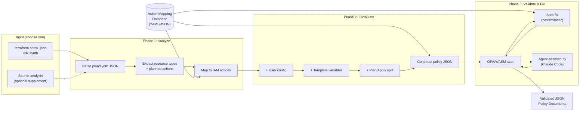

### Cold Start: Bootstrap Workflow

For new stacks where no deployment role exists yet, the tool provides a seed role to break the chicken-and-egg problem:

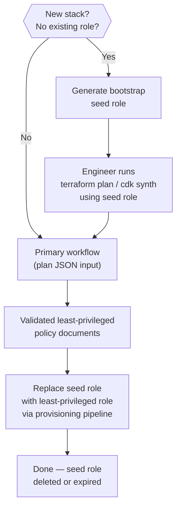

### What This Tool Produces

JSON policy documents: trust policy documents, permission policy documents, and role metadata. These are submitted to a **separate provisioning pipeline** owned by another team, which runs its own static analysis (the 3rd party scanner) and then creates the IAM roles and policies in AWS.

This tool does NOT:
- Create IAM roles or policies directly in AWS
- Generate Terraform resources, CDK constructs, or CloudFormation templates
- Design runtime execution roles (Lambda, ECS task, Step Functions, etc.)
- Design application-level IAM or human user IAM

### Key Design Constraints

- **Plan-JSON-primary**: The primary input is `terraform show -json` output or `cdk synth` CloudFormation templates — not source code. This gives fully resolved resources (modules flattened, variables interpolated, computed values present) and accurate planned action types (create, update, delete, no-op).
- **Zero drift across accounts**: The same policy documents must work in all target accounts (dev, staging, prod) without modification. Account IDs, regions, and environment-specific values are templated.
- **Shift-left enforcement**: The organization relies on rigorous least-privilege policy scoping and static analysis — not SCPs — as the primary security enforcement mechanism.

## Scope

### In Scope

- IAM permission policy documents (JSON) for GitHub Actions deployment roles
- IAM trust policy documents (JSON) for AssumeRoleWithWebIdentity via OIDC
- Two-role architecture: plan role (read-only, used on PRs) and apply role (full CRUD, used on merge to main)
- Bootstrap seed role generation for cold-start scenarios
- Terraform and AWS CDK as supported IaC tools
- Toolchain permissions (Terraform state backend, CDK bootstrap/CloudFormation)
- Resource-to-IAM-action mapping from plan/synth JSON (primary) or source code (optional)
- Templated policy variables for multi-account, multi-region deployment
- OPA/WASM policy engine for local pre-validation
- Automated and agent-assisted fix loop for policy violations

### Out of Scope

- **Direct IAM resource creation** in AWS
- **Runtime execution roles**: Lambda execution roles, ECS task execution/task roles, EC2 instance profiles, Step Functions execution roles — these are resources the IaC *creates*, not the deployment role itself
- **Application-level IAM**: Runtime access to DynamoDB, S3, SQS, etc.
- **Human user IAM**: Console access, developer credentials, SSO
- **GitHub Enterprise Server**: Only GitHub.com (including Enterprise Cloud) is supported
- **Reusable workflows**: Not supported in OIDC trust scope
- **Non-main default branches**: OIDC trust is scoped to `main` only

## Fixed Configuration

These values are fixed across all generated policies and do not require user input:

| Parameter | Value | Rationale |
|---|---|---|
| OIDC Provider URL | `token.actions.githubusercontent.com` | GitHub.com / Enterprise Cloud only |
| OIDC Audience | `sts.amazonaws.com` | Standard for AWS federation |
| Apply role trust — branch | `ref:refs/heads/main` | Default branch only |
| Plan role trust — trigger | `pull_request` | PRs trigger plan/diff |
| Max Session Duration | `3600` (1 hour) | Sufficient for all deployments |
| AWS Partition | `aws` | Standard partition only |

## Template Variables

Policies use template variables for values that differ across accounts or environments. The provisioning pipeline resolves these at creation time.

| Variable | Description | Example Resolution |
|---|---|---|
| `${account_id}` | Target AWS account ID | `123456789012` |
| `${region}` | Target AWS region (or `*` for multi-region) | `us-east-1` or `*` |
| `${environment}` | Environment name | `dev`, `staging`, `prod` |
| `${org}` | GitHub organization name | `my-org` |
| `${repo}` | GitHub repository name | `infra-repo` |
| `${resource_prefix}` | Organizational resource naming prefix | `myteam-${environment}` |
| `${state_bucket}` | Terraform state S3 bucket name | `myorg-terraform-state` |
| `${state_key_prefix}` | Terraform state key prefix | `infra/` |
| `${lock_table}` | Terraform DynamoDB lock table name | `terraform-locks` |
| `${cdk_qualifier}` | CDK bootstrap qualifier | `hnb659fds` (default) |

**Region handling**: For resources deployed to a single known region, use the specific region. For resources deployed across multiple regions, use `${region}` which may resolve to `*` in the ARN. When `*` is used for region in an ARN, add an `aws:RequestedRegion` condition with the explicit list of allowed regions to maintain least privilege.

---

# Action Mapping Database

## Purpose

The Action Mapping Database is a structured data file (YAML or JSON) that centralizes all AWS-specific knowledge the tool needs to translate resource types into IAM permissions. Every phase of the tool reads from this database rather than hardcoding AWS knowledge in application logic. This separation means the database can be updated independently — when AWS adds new services, changes API patterns, or you discover missing mappings through 3rd party scanner rejections — without modifying tool code.

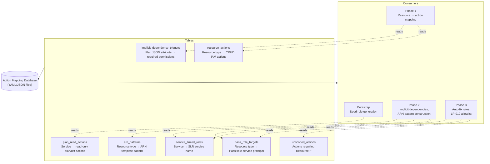

## File Structure

```
action-mapping-db/
├── resource_actions.yaml       # Table 1: Resource type → CRUD IAM actions
├── plan_read_actions.yaml      # Table 2: Service → read-only actions for plan/diff
├── pass_role_targets.yaml      # Table 3: Resource type → PassRole service principal
├── service_linked_roles.yaml   # Table 4: Service → SLR service name
├── unscoped_actions.yaml       # Table 5: Actions that require Resource: *
├── implicit_triggers.yaml      # Table 6: Plan JSON attributes → implicit permissions
├── arn_patterns.yaml           # Table 7: Resource type → ARN template patterns
└── VERSION                     # Database version (semver)
```

Each file is independently versionable but the `VERSION` file tracks the database as a whole. The tool should log the database version in its output metadata for traceability.

## Table Schemas

### Table 1: `resource_actions`

Maps AWS resource types (both Terraform and CloudFormation names) to the IAM actions needed for each CRUD operation. This is the core lookup table for Phase 1.

```yaml
# resource_actions.yaml
version: "1.0.0"
entries:
  - terraform_type: "aws_ecs_cluster"
    cloudformation_type: "AWS::ECS::Cluster"
    service: "ecs"
    actions:
      read:
        - "ecs:DescribeClusters"
        - "ecs:ListTagsForResource"
      create:
        - "ecs:CreateCluster"
      update:
        - "ecs:UpdateCluster"
        - "ecs:UpdateClusterSettings"
      delete:
        - "ecs:DeleteCluster"
      tag:
        - "ecs:TagResource"
        - "ecs:UntagResource"
    supports_resource_scoping: true
    arn_template: "arn:aws:ecs:${region}:${account_id}:cluster/${resource_name}"
    notes: "ListClusters is unscoped (requires Resource: *)"

  - terraform_type: "aws_s3_bucket"
    cloudformation_type: "AWS::S3::Bucket"
    service: "s3"
    actions:
      read:
        - "s3:GetBucketLocation"
        - "s3:GetBucketPolicy"
        - "s3:GetBucketAcl"
        - "s3:GetBucketCORS"
        - "s3:GetBucketVersioning"
        - "s3:GetBucketLogging"
        - "s3:GetBucketTagging"
        - "s3:GetEncryptionConfiguration"
        - "s3:GetLifecycleConfiguration"
        - "s3:GetReplicationConfiguration"
        - "s3:GetAccelerateConfiguration"
        - "s3:GetBucketObjectLockConfiguration"
        - "s3:GetBucketPublicAccessBlock"
        - "s3:GetBucketWebsite"
        - "s3:ListBucket"
      create:
        - "s3:CreateBucket"
        - "s3:PutBucketPolicy"
        - "s3:PutBucketAcl"
        - "s3:PutBucketCORS"
        - "s3:PutBucketVersioning"
        - "s3:PutBucketLogging"
        - "s3:PutBucketTagging"
        - "s3:PutEncryptionConfiguration"
        - "s3:PutLifecycleConfiguration"
        - "s3:PutBucketPublicAccessBlock"
      update:
        - "s3:PutBucketPolicy"
        - "s3:PutBucketAcl"
        - "s3:PutBucketCORS"
        - "s3:PutBucketVersioning"
        - "s3:PutBucketLogging"
        - "s3:PutBucketTagging"
        - "s3:PutEncryptionConfiguration"
        - "s3:PutLifecycleConfiguration"
        - "s3:PutBucketPublicAccessBlock"
      delete:
        - "s3:DeleteBucket"
        - "s3:DeleteBucketPolicy"
      tag:
        - "s3:PutBucketTagging"
    supports_resource_scoping: true
    arn_template: "arn:aws:s3:::${resource_name}"
    notes: "Bucket ARNs do not include region or account"

  - terraform_type: "aws_lambda_function"
    cloudformation_type: "AWS::Lambda::Function"
    service: "lambda"
    actions:
      read:
        - "lambda:GetFunction"
        - "lambda:GetFunctionConfiguration"
        - "lambda:GetFunctionCodeSigningConfig"
        - "lambda:GetPolicy"
        - "lambda:ListVersionsByFunction"
        - "lambda:ListTags"
      create:
        - "lambda:CreateFunction"
      update:
        - "lambda:UpdateFunctionCode"
        - "lambda:UpdateFunctionConfiguration"
        - "lambda:PublishVersion"
      delete:
        - "lambda:DeleteFunction"
      tag:
        - "lambda:TagResource"
        - "lambda:UntagResource"
    supports_resource_scoping: true
    arn_template: "arn:aws:lambda:${region}:${account_id}:function:${resource_name}"

  # ... additional resource types follow the same schema
```

**Update trigger**: Add entries when encountering a resource type not in the database. The tool should log unknown resource types and prompt the operator to add them.

### Table 2: `plan_read_actions`

Maps AWS service names to the read-only actions required during `terraform plan` / `cdk diff`. Used by both the bootstrap seed role generator and Phase 1 for categorizing read actions.

```yaml
# plan_read_actions.yaml
version: "1.0.0"
entries:
  - service: "ecs"
    actions:
      - "ecs:DescribeClusters"
      - "ecs:DescribeServices"
      - "ecs:DescribeTaskDefinition"
      - "ecs:ListClusters"
      - "ecs:ListServices"
      - "ecs:ListTaskDefinitions"
      - "ecs:DescribeContainerInstances"
      - "ecs:ListTagsForResource"

  - service: "ec2"
    actions:
      - "ec2:DescribeVpcs"
      - "ec2:DescribeSubnets"
      - "ec2:DescribeSecurityGroups"
      - "ec2:DescribeRouteTables"
      - "ec2:DescribeInternetGateways"
      - "ec2:DescribeNatGateways"
      - "ec2:DescribeNetworkInterfaces"
      - "ec2:DescribeAvailabilityZones"
      - "ec2:DescribeAddresses"
      - "ec2:DescribeInstances"
      - "ec2:DescribeVolumes"
      - "ec2:DescribeVpcEndpoints"
      - "ec2:DescribeTags"
      - "ec2:DescribeKeyPairs"
      - "ec2:DescribeImages"
      - "ec2:DescribeAccountAttributes"

  - service: "rds"
    actions:
      - "rds:DescribeDBInstances"
      - "rds:DescribeDBClusters"
      - "rds:DescribeDBSubnetGroups"
      - "rds:DescribeDBParameterGroups"
      - "rds:DescribeDBClusterParameterGroups"
      - "rds:DescribeOptionGroups"
      - "rds:ListTagsForResource"

  - service: "lambda"
    actions:
      - "lambda:GetFunction"
      - "lambda:ListFunctions"
      - "lambda:GetFunctionConfiguration"
      - "lambda:ListVersionsByFunction"
      - "lambda:GetPolicy"
      - "lambda:ListLayers"
      - "lambda:GetLayerVersion"
      - "lambda:ListTags"

  - service: "s3"
    actions:
      - "s3:GetBucketLocation"
      - "s3:GetBucketPolicy"
      - "s3:GetBucketAcl"
      - "s3:GetBucketCORS"
      - "s3:GetBucketVersioning"
      - "s3:GetBucketLogging"
      - "s3:GetBucketTagging"
      - "s3:GetEncryptionConfiguration"
      - "s3:GetLifecycleConfiguration"
      - "s3:GetReplicationConfiguration"
      - "s3:ListBucket"

  - service: "elasticloadbalancing"
    actions:
      - "elasticloadbalancing:DescribeLoadBalancers"
      - "elasticloadbalancing:DescribeTargetGroups"
      - "elasticloadbalancing:DescribeListeners"
      - "elasticloadbalancing:DescribeRules"
      - "elasticloadbalancing:DescribeTargetHealth"
      - "elasticloadbalancing:DescribeTags"
      - "elasticloadbalancing:DescribeLoadBalancerAttributes"
      - "elasticloadbalancing:DescribeTargetGroupAttributes"

  - service: "route53"
    actions:
      - "route53:GetHostedZone"
      - "route53:ListHostedZones"
      - "route53:ListResourceRecordSets"
      - "route53:GetHealthCheck"
      - "route53:ListTagsForResource"
      - "route53:ListHostedZonesByName"

  - service: "cloudwatch"
    actions:
      - "cloudwatch:DescribeAlarms"
      - "cloudwatch:ListMetrics"
      - "cloudwatch:ListTagsForResource"
      - "cloudwatch:GetDashboard"
      - "cloudwatch:ListDashboards"

  - service: "logs"
    actions:
      - "logs:DescribeLogGroups"
      - "logs:ListTagsLogGroup"
      - "logs:DescribeMetricFilters"
      - "logs:DescribeSubscriptionFilters"

  - service: "sns"
    actions:
      - "sns:GetTopicAttributes"
      - "sns:ListTopics"
      - "sns:ListSubscriptionsByTopic"
      - "sns:ListTagsForResource"

  - service: "sqs"
    actions:
      - "sqs:GetQueueAttributes"
      - "sqs:GetQueueUrl"
      - "sqs:ListQueues"
      - "sqs:ListQueueTags"

  - service: "iam"
    actions:
      - "iam:GetRole"
      - "iam:GetRolePolicy"
      - "iam:ListRolePolicies"
      - "iam:ListAttachedRolePolicies"
      - "iam:GetPolicy"
      - "iam:GetPolicyVersion"
      - "iam:ListInstanceProfilesForRole"
      - "iam:GetInstanceProfile"

  - service: "secretsmanager"
    actions:
      - "secretsmanager:DescribeSecret"
      - "secretsmanager:ListSecrets"
      - "secretsmanager:GetResourcePolicy"

  - service: "ssm"
    actions:
      - "ssm:GetParameter"
      - "ssm:GetParameters"
      - "ssm:DescribeParameters"
      - "ssm:ListTagsForResource"

  - service: "kms"
    actions:
      - "kms:DescribeKey"
      - "kms:GetKeyPolicy"
      - "kms:GetKeyRotationStatus"
      - "kms:ListAliases"
      - "kms:ListResourceTags"

  - service: "acm"
    actions:
      - "acm:DescribeCertificate"
      - "acm:ListCertificates"
      - "acm:ListTagsForCertificate"

  - service: "dynamodb"
    actions:
      - "dynamodb:DescribeTable"
      - "dynamodb:DescribeContinuousBackups"
      - "dynamodb:DescribeTimeToLive"
      - "dynamodb:ListTagsOfResource"

  - service: "ecr"
    actions:
      - "ecr:DescribeRepositories"
      - "ecr:GetRepositoryPolicy"
      - "ecr:ListTagsForResource"
      - "ecr:GetLifecyclePolicy"

  - service: "events"
    actions:
      - "events:DescribeRule"
      - "events:ListRules"
      - "events:ListTargetsByRule"
      - "events:ListTagsForResource"

  - service: "autoscaling"
    actions:
      - "autoscaling:DescribeAutoScalingGroups"
      - "autoscaling:DescribeLaunchConfigurations"
      - "autoscaling:DescribePolicies"
      - "autoscaling:DescribeTags"

  - service: "cloudfront"
    actions:
      - "cloudfront:GetDistribution"
      - "cloudfront:ListDistributions"
      - "cloudfront:ListTagsForResource"

  - service: "elasticache"
    actions:
      - "elasticache:DescribeCacheClusters"
      - "elasticache:DescribeReplicationGroups"
      - "elasticache:DescribeCacheSubnetGroups"
      - "elasticache:ListTagsForResource"
```

**Update trigger**: When a `terraform plan` fails with `AccessDenied` on a Describe/List/Get action not in this table, add it.

### Table 3: `pass_role_targets`

Maps resource types to the AWS service principal that receives the passed role. Used by Phase 2 for implicit dependency detection and Phase 3 for auto-fixing `LP-021`.

```yaml
# pass_role_targets.yaml
version: "1.0.0"
entries:
  - terraform_type: "aws_ecs_service"
    cloudformation_type: "AWS::ECS::Service"
    passed_to_service: "ecs-tasks.amazonaws.com"
    role_attribute: "task_definition"
    notes: "Role is on the task definition, but PassRole needed at service creation"

  - terraform_type: "aws_ecs_task_definition"
    cloudformation_type: "AWS::ECS::TaskDefinition"
    passed_to_service: "ecs-tasks.amazonaws.com"
    role_attribute: "execution_role_arn, task_role_arn"

  - terraform_type: "aws_lambda_function"
    cloudformation_type: "AWS::Lambda::Function"
    passed_to_service: "lambda.amazonaws.com"
    role_attribute: "role"

  - terraform_type: "aws_instance"
    cloudformation_type: "AWS::EC2::Instance"
    passed_to_service: "ec2.amazonaws.com"
    role_attribute: "iam_instance_profile"
    notes: "PassRole target is the role inside the instance profile"

  - terraform_type: "aws_codebuild_project"
    cloudformation_type: "AWS::CodeBuild::Project"
    passed_to_service: "codebuild.amazonaws.com"
    role_attribute: "service_role"

  - terraform_type: "aws_codepipeline"
    cloudformation_type: "AWS::CodePipeline::Pipeline"
    passed_to_service: "codepipeline.amazonaws.com"
    role_attribute: "role_arn"

  - terraform_type: "aws_sfn_state_machine"
    cloudformation_type: "AWS::StepFunctions::StateMachine"
    passed_to_service: "states.amazonaws.com"
    role_attribute: "role_arn"

  - terraform_type: "aws_batch_compute_environment"
    cloudformation_type: "AWS::Batch::ComputeEnvironment"
    passed_to_service: "batch.amazonaws.com"
    role_attribute: "service_role"

  - terraform_type: "aws_sagemaker_notebook_instance"
    cloudformation_type: "AWS::SageMaker::NotebookInstance"
    passed_to_service: "sagemaker.amazonaws.com"
    role_attribute: "role_arn"

  - terraform_type: "aws_glue_job"
    cloudformation_type: "AWS::Glue::Job"
    passed_to_service: "glue.amazonaws.com"
    role_attribute: "role_arn"

  - terraform_type: "aws_eks_node_group"
    cloudformation_type: "AWS::EKS::Nodegroup"
    passed_to_service: "ec2.amazonaws.com"
    role_attribute: "node_role_arn"

  - terraform_type: "aws_ecs_capacity_provider"
    cloudformation_type: "AWS::ECS::CapacityProvider"
    passed_to_service: "autoscaling.amazonaws.com"
    role_attribute: "auto_scaling_group_provider.managed_scaling"
    notes: "Requires PassRole for ASG role"

  - terraform_type: "aws_datasync_task"
    cloudformation_type: "AWS::DataSync::Task"
    passed_to_service: "datasync.amazonaws.com"
    role_attribute: "cloudwatch_log_group_arn"
    notes: "Logging role"

  - terraform_type: "aws_firehose_delivery_stream"
    cloudformation_type: "AWS::KinesisFirehose::DeliveryStream"
    passed_to_service: "firehose.amazonaws.com"
    role_attribute: "role_arn"

  - terraform_type: "aws_iot_topic_rule"
    cloudformation_type: "AWS::IoT::TopicRule"
    passed_to_service: "iot.amazonaws.com"
    role_attribute: "role_arn"
```

**Update trigger**: When the 3rd party scanner rejects a policy for missing `iam:PassedToService` on a resource type not in this table, add it.

### Table 4: `service_linked_roles`

Maps AWS services to their service-linked role service name. Used by Phase 2 for detecting SLR needs and Phase 3 for auto-fixing `LP-023`.

```yaml
# service_linked_roles.yaml
version: "1.0.0"
entries:
  - service: "ecs"
    slr_service_name: "ecs.amazonaws.com"
    trigger_resource_types:
      - "aws_ecs_cluster"
      - "aws_ecs_service"
    notes: "Required on first ECS usage in an account"

  - service: "elasticloadbalancing"
    slr_service_name: "elasticloadbalancing.amazonaws.com"
    trigger_resource_types:
      - "aws_lb"
      - "aws_alb"
      - "aws_lb_target_group"
    notes: "Required for ALB, NLB, GLB"

  - service: "rds"
    slr_service_name: "rds.amazonaws.com"
    trigger_resource_types:
      - "aws_db_instance"
      - "aws_rds_cluster"
    notes: "Required for Enhanced Monitoring if enabled"

  - service: "autoscaling"
    slr_service_name: "autoscaling.amazonaws.com"
    trigger_resource_types:
      - "aws_autoscaling_group"
      - "aws_appautoscaling_target"

  - service: "elasticache"
    slr_service_name: "elasticache.amazonaws.com"
    trigger_resource_types:
      - "aws_elasticache_cluster"
      - "aws_elasticache_replication_group"

  - service: "opensearch"
    slr_service_name: "opensearchservice.amazonaws.com"
    trigger_resource_types:
      - "aws_opensearch_domain"
    notes: "Legacy: es.amazonaws.com for Elasticsearch domains"

  - service: "eks"
    slr_service_name: "eks.amazonaws.com"
    trigger_resource_types:
      - "aws_eks_cluster"

  - service: "lambda"
    slr_service_name: "lambda.amazonaws.com"
    trigger_resource_types:
      - "aws_lambda_function"
    notes: "Only needed for VPC-enabled Lambda functions"
    condition: "vpc_config is present"

  - service: "spot"
    slr_service_name: "spot.amazonaws.com"
    trigger_resource_types:
      - "aws_spot_fleet_request"
      - "aws_spot_instance_request"

  - service: "transitgateway"
    slr_service_name: "transitgateway.amazonaws.com"
    trigger_resource_types:
      - "aws_ec2_transit_gateway"
```

**Update trigger**: When a first-time deployment fails with `iam:CreateServiceLinkedRole` access denied, add the service mapping.

### Table 5: `unscoped_actions`

Actions that legitimately require `Resource: "*"` because AWS does not support resource-level permissions for them. Phase 3 uses this as the allowlist for `LP-010` — any action NOT in this list that has `Resource: "*"` is flagged as a violation.

```yaml
# unscoped_actions.yaml
version: "1.0.0"
actions:
  # EC2
  - "ec2:DescribeVpcs"
  - "ec2:DescribeSubnets"
  - "ec2:DescribeSecurityGroups"
  - "ec2:DescribeRouteTables"
  - "ec2:DescribeInternetGateways"
  - "ec2:DescribeNatGateways"
  - "ec2:DescribeVpcEndpoints"
  - "ec2:DescribeNetworkInterfaces"
  - "ec2:DescribeAvailabilityZones"
  - "ec2:DescribeAccountAttributes"
  - "ec2:DescribeAddresses"
  - "ec2:DescribeImages"
  - "ec2:DescribeInstances"
  - "ec2:DescribeKeyPairs"
  - "ec2:DescribeVolumes"
  - "ec2:DescribeTags"

  # ECS
  - "ecs:ListClusters"
  - "ecs:ListServices"
  - "ecs:ListTaskDefinitions"
  - "ecs:ListTasks"

  # ELB
  - "elasticloadbalancing:DescribeLoadBalancers"
  - "elasticloadbalancing:DescribeTargetGroups"
  - "elasticloadbalancing:DescribeListeners"
  - "elasticloadbalancing:DescribeRules"
  - "elasticloadbalancing:DescribeTargetHealth"
  - "elasticloadbalancing:DescribeTags"

  # RDS
  - "rds:DescribeDBInstances"
  - "rds:DescribeDBClusters"
  - "rds:DescribeDBSubnetGroups"

  # Lambda
  - "lambda:ListFunctions"
  - "lambda:ListLayers"
  - "lambda:GetAccountSettings"

  # CloudWatch
  - "cloudwatch:DescribeAlarms"
  - "cloudwatch:ListMetrics"

  # Logs
  - "logs:DescribeLogGroups"

  # SNS / SQS
  - "sns:ListTopics"
  - "sqs:ListQueues"

  # Route53
  - "route53:ListHostedZones"
  - "route53:GetHostedZoneCount"

  # Other
  - "acm:ListCertificates"
  - "secretsmanager:ListSecrets"
  - "ssm:DescribeParameters"
  - "sts:GetCallerIdentity"
  - "cloudformation:ListStacks"
  - "cloudformation:GetTemplateSummary"
```

**Update trigger**: When the 3rd party scanner accepts `Resource: "*"` for an action not in this list, or when the AWS IAM documentation confirms an action doesn't support resource-level permissions, add it.

### Table 6: `implicit_triggers`

Maps plan JSON attribute patterns to implicit IAM permissions that aren't captured by the resource type's own CRUD actions. Phase 1 uses this to detect hidden dependencies.

```yaml
# implicit_triggers.yaml
version: "1.0.0"
entries:
  # PassRole triggers — detected from planned resource attributes
  - attribute_pattern: "role|role_arn|task_role_arn|execution_role_arn|service_role"
    trigger: "pass_role"
    lookup: "pass_role_targets"
    notes: "Cross-reference with pass_role_targets.yaml using the resource type"

  - attribute_pattern: "iam_instance_profile"
    trigger: "pass_role"
    passed_to_service: "ec2.amazonaws.com"

  # CloudWatch Logs triggers
  - attribute_pattern: "log_configuration|log_group_name|logging_configuration|cloudwatch_log_group_arn"
    trigger: "cloudwatch_logs"
    required_actions:
      apply_only:
        - "logs:CreateLogGroup"
        - "logs:PutRetentionPolicy"
        - "logs:TagResource"
      plan_and_apply:
        - "logs:DescribeLogGroups"
        - "logs:ListTagsLogGroup"
    resource_pattern: "arn:aws:logs:${region}:${account_id}:log-group:${inferred_log_group_name}:*"

  # KMS triggers
  - attribute_pattern: "kms_key_id|kms_key_arn|encryption_configuration.kms_key|server_side_encryption_configuration"
    trigger: "kms"
    required_actions:
      apply_only:
        - "kms:CreateGrant"
        - "kms:GenerateDataKey"
        - "kms:Decrypt"
        - "kms:Encrypt"
      plan_and_apply:
        - "kms:DescribeKey"
    resource_pattern: "Value from the attribute itself (the KMS key ARN)"

  # VPC triggers on Lambda (triggers SLR need)
  - attribute_pattern: "vpc_config"
    resource_type_filter: "aws_lambda_function"
    trigger: "lambda_vpc"
    required_actions:
      apply_only:
        - "ec2:CreateNetworkInterface"
        - "ec2:DeleteNetworkInterface"
      plan_and_apply:
        - "ec2:DescribeNetworkInterfaces"
        - "ec2:DescribeSecurityGroups"
        - "ec2:DescribeSubnets"
        - "ec2:DescribeVpcs"

  # Secrets Manager triggers (e.g., RDS managed passwords)
  - attribute_pattern: "manage_master_user_password"
    resource_type_filter: "aws_db_instance|aws_rds_cluster"
    trigger: "secrets_manager"
    required_actions:
      apply_only:
        - "secretsmanager:CreateSecret"
        - "secretsmanager:TagResource"
      plan_and_apply:
        - "secretsmanager:DescribeSecret"
    notes: "RDS creates a Secrets Manager secret when manage_master_user_password is true"

  # S3 notification triggers
  - attribute_pattern: "lambda_function|queue|topic"
    resource_type_filter: "aws_s3_bucket_notification"
    trigger: "cross_service_permissions"
    notes: "May require lambda:AddPermission, sqs:GetQueueAttributes, sns:GetTopicAttributes"
```

**Update trigger**: When a deployment fails with unexpected `AccessDenied` on an action not obviously connected to the resource type, investigate the planned attributes, identify the trigger pattern, and add it.

### Table 7: `arn_patterns`

Maps resource types to their ARN template patterns. Phase 2 uses this to construct the most specific `Resource` values in policy statements.

```yaml
# arn_patterns.yaml
version: "1.0.0"
entries:
  - terraform_type: "aws_ecs_cluster"
    arn_pattern: "arn:aws:ecs:${region}:${account_id}:cluster/${resource_prefix}-*"
    supports_name_scoping: true
    name_attribute: "name"

  - terraform_type: "aws_ecs_service"
    arn_pattern: "arn:aws:ecs:${region}:${account_id}:service/${cluster_name}/${resource_prefix}-*"
    supports_name_scoping: true
    name_attribute: "name"
    notes: "Service ARN includes cluster name as parent"

  - terraform_type: "aws_s3_bucket"
    arn_pattern: "arn:aws:s3:::${resource_prefix}-*"
    supports_name_scoping: true
    name_attribute: "bucket"
    notes: "No region or account in S3 bucket ARNs"

  - terraform_type: "aws_lambda_function"
    arn_pattern: "arn:aws:lambda:${region}:${account_id}:function:${resource_prefix}-*"
    supports_name_scoping: true
    name_attribute: "function_name"

  - terraform_type: "aws_iam_role"
    arn_pattern: "arn:aws:iam::${account_id}:role/${resource_prefix}-*"
    supports_name_scoping: true
    name_attribute: "name"
    notes: "IAM is global — no region in ARN"

  - terraform_type: "aws_db_instance"
    arn_pattern: "arn:aws:rds:${region}:${account_id}:db:${resource_prefix}-*"
    supports_name_scoping: true
    name_attribute: "identifier"

  - terraform_type: "aws_vpc"
    arn_pattern: "arn:aws:ec2:${region}:${account_id}:vpc/*"
    supports_name_scoping: false
    notes: "VPC IDs are auto-generated — cannot scope by name. Use tag conditions instead."
    recommended_condition: "aws:ResourceTag/Name"

  - terraform_type: "aws_security_group"
    arn_pattern: "arn:aws:ec2:${region}:${account_id}:security-group/*"
    supports_name_scoping: false
    notes: "SG IDs are auto-generated. Use tag conditions."
    recommended_condition: "aws:ResourceTag/Name"

  - terraform_type: "aws_subnet"
    arn_pattern: "arn:aws:ec2:${region}:${account_id}:subnet/*"
    supports_name_scoping: false
    recommended_condition: "aws:ResourceTag/Name"

  - terraform_type: "aws_lb"
    arn_pattern: "arn:aws:elasticloadbalancing:${region}:${account_id}:loadbalancer/app/${resource_prefix}-*/*"
    supports_name_scoping: true
    name_attribute: "name"
    notes: "ARN includes load balancer type (app/net/gw) and auto-generated ID suffix"

  # ... additional patterns
```

**Update trigger**: When the tool encounters a resource type without an ARN pattern, fall back to `Resource: "*"` with conditions and log the missing mapping for the operator to add.

## Maintenance Process

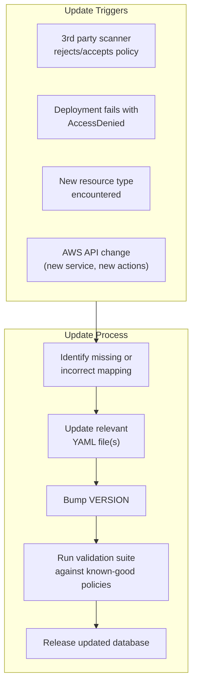

### Update Guidelines

1. **Additive-first**: New entries are added; existing entries are modified only when incorrect. Removing entries is a breaking change requiring a major version bump.
2. **Source of truth**: The database is the single source of truth for AWS-specific knowledge. Tool code should never hardcode action names, ARN patterns, or service mappings — always read from the database.
3. **Version pinning**: The tool should pin to a specific database version and upgrade deliberately. A `--db-version` flag or config option controls which version is used.
4. **Validation on update**: After any database change, run the tool's existing OPA rules against a suite of known-good policy documents to catch regressions (e.g., an entry removed from `unscoped_actions` would cause existing policies to fail `LP-010`).
5. **Starter data**: The YAML examples in this spec are the v1.0.0 starter data. They cover the most common deployment patterns. Extend them as the tool encounters new resource types and services.

---

# Bootstrap: Seed Role for Cold Starts

## Purpose

When an engineer is creating a brand new stack and no deployment role exists, they can't run `terraform plan` or `cdk synth` (with context lookups) — which means they can't produce the plan JSON this tool requires as primary input. The bootstrap seed role breaks this deadlock.

## Design Principles

- **Best-guess least privilege**: The seed role is scoped as tightly as possible for plan/diff operations only — not a broad admin role. It permits read operations that plan/diff require plus toolchain access (state read, CloudFormation describe).
- **Time-boxed**: The seed role should have a short TTL. The provisioning pipeline should enforce a maximum lifetime (recommended: 7 days). After the engineer uses it to generate plan JSON and produce the real role, the seed role is replaced or deleted.
- **Marked as temporary**: The seed role name and tags should clearly indicate it is a bootstrap artifact, not a permanent deployment role (e.g., role name: `${resource_prefix}-github-seed`, tag: `Purpose=bootstrap-seed`).
- **Plan-only trust**: The seed role trusts `pull_request` events only — the same trust scope as the permanent plan role. It should NOT trust `ref:refs/heads/main`, meaning it cannot be used for `terraform apply` or `cdk deploy`.

## Seed Role Generation

### Input

The engineer provides a minimal configuration:

| Input | Required | Description |
|---|---|---|
| `iac_tool` | Yes | `terraform` or `cdk` |
| `github_org` | Yes | GitHub organization |
| `github_repo` | Yes | GitHub repository |
| `resource_prefix` | Yes | Naming prefix for resources |
| `target_services` | Yes | List of AWS services the IaC will manage (e.g., `["ecs", "ec2", "rds", "lambda"]`) |
| `state_bucket` | Terraform only | S3 bucket for state |
| `state_key_prefix` | Terraform only | State key prefix |
| `lock_table` | Terraform only | DynamoDB lock table |
| `cdk_qualifier` | CDK only | Bootstrap qualifier (default: `hnb659fds`) |

### Seed Role Structure

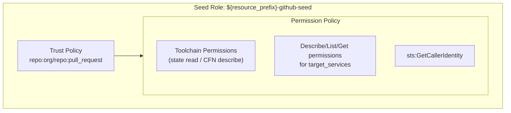

**Constraints**: TTL 7 days. Tag `Purpose=bootstrap-seed`. No write/create/delete actions.

### Seed Permission Generation per Service

For each service in `target_services`, the seed role includes read-only actions from the **`plan_read_actions` table** in the Action Mapping Database. The tool looks up the service key and includes all listed actions.

```
seed_permissions = []
for service in target_services:
    entry = plan_read_actions.lookup(service)
    if entry:
        seed_permissions.extend(entry.actions)
    else:
        log.warn(f"Service '{service}' not found in plan_read_actions — engineer must manually specify read actions")
```

If a requested service is not in the database, the tool should warn the engineer and suggest adding it. This is the primary mechanism for extending seed role coverage over time without code changes.

### Seed Toolchain Permissions

#### Terraform

| Action | Resource | Purpose |
|---|---|---|
| `sts:GetCallerIdentity` | `*` | Provider initialization |
| `s3:GetObject` | `arn:aws:s3:::${state_bucket}/${state_key_prefix}*` | Read state |
| `s3:ListBucket` | `arn:aws:s3:::${state_bucket}` | List state files |
| `dynamodb:GetItem` | `arn:aws:dynamodb:${region}:${account_id}:table/${lock_table}` | Check lock (plan doesn't acquire) |

#### CDK

| Action | Resource | Purpose |
|---|---|---|
| `sts:GetCallerIdentity` | `*` | Account resolution |
| `cloudformation:DescribeStacks` | `arn:aws:cloudformation:${region}:${account_id}:stack/*` | Check stack state |
| `cloudformation:GetTemplate` | `arn:aws:cloudformation:${region}:${account_id}:stack/*` | Diff current template |
| `cloudformation:GetTemplateSummary` | `*` | Template analysis |
| `cloudformation:ListStacks` | `*` | Enumerate stacks |
| `cloudformation:DescribeStackEvents` | `arn:aws:cloudformation:${region}:${account_id}:stack/*` | Stack events |
| `cloudformation:DescribeStackResources` | `arn:aws:cloudformation:${region}:${account_id}:stack/*` | Resource enumeration |
| `cloudformation:ListStackResources` | `arn:aws:cloudformation:${region}:${account_id}:stack/*` | Resource enumeration |
| `cloudformation:DescribeChangeSet` | `arn:aws:cloudformation:${region}:${account_id}:stack/*` | Review changes |
| `ssm:GetParameter` | `arn:aws:ssm:${region}:${account_id}:parameter/cdk-bootstrap/${cdk_qualifier}/version` | Bootstrap version |
| `s3:GetObject`, `s3:ListBucket` | `arn:aws:s3:::cdk-${cdk_qualifier}-assets-${account_id}-*` | Read bootstrap bucket |

Additionally, include CDK context lookup permissions if the engineer indicates their app uses them:
- `ec2:DescribeVpcs`, `ec2:DescribeSubnets`, `ec2:DescribeRouteTables`, `ec2:DescribeVpnGateways`, `ec2:DescribeInternetGateways`, `ec2:DescribeNatGateways`
- `route53:ListHostedZonesByName`
- `ssm:GetParameter`
- `ec2:DescribeSecurityGroups`

### Bootstrap Workflow

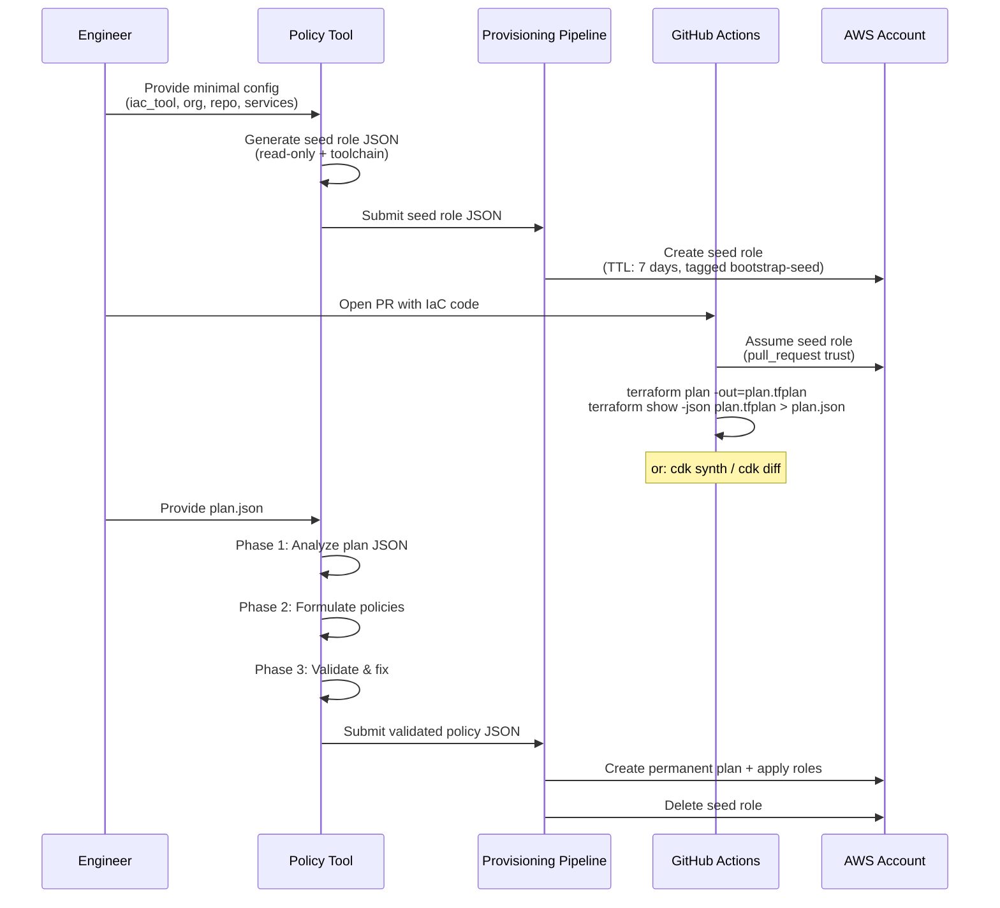

### Seed Role Output

The seed role output follows the same JSON structure as permanent roles (Phase 2 output) but with:
- Only one role (plan-equivalent, no apply role)
- `"bootstrap": true` flag in metadata
- `"ttl_days": 7` for the provisioning pipeline
- `"replaces": null` (first creation) or `"replaces": "<previous-seed-role-name>"`
- Role name pattern: `${resource_prefix}-github-seed`
- Tag: `Purpose=bootstrap-seed`

---

# Phase 1: Plan/Synth Analysis

## Purpose

Parse Terraform plan JSON or CDK CloudFormation synth output and produce a structured action inventory: every IAM action the deployment role needs, categorized by operation type and role assignment.

## Why Plan JSON Over Source Analysis

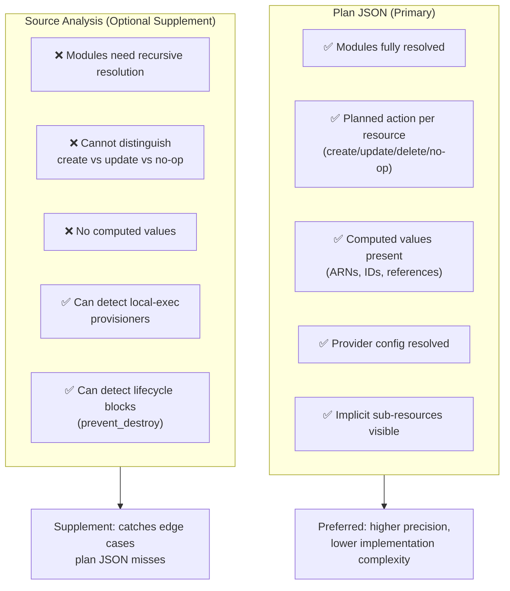

## Primary Input: Terraform Plan JSON

### How the Engineer Generates It

```bash
# Generate plan file
terraform plan -out=plan.tfplan

# Convert to JSON
terraform show -json plan.tfplan > plan.json
```

No special tooling required — standard Terraform. The JSON output is the same regardless of backend, provider version, or module complexity.

### What to Parse

The Terraform plan JSON has this top-level structure (documented at [Terraform JSON Output Format](https://developer.hashicorp.com/terraform/internals/json-format)):

```json
{
  "format_version": "1.2",
  "terraform_version": "1.7.0",
  "planned_values": { "root_module": { "resources": [] } },
  "resource_changes": [],
  "configuration": { "provider_config": {}, "root_module": {} },
  "prior_state": { "values": { "root_module": { "resources": [] } } }
}
```

#### Primary extraction target: `resource_changes`

Each element represents one resource and its planned action:

```json
{
  "address": "module.networking.aws_vpc.main",
  "type": "aws_vpc",
  "provider_name": "registry.terraform.io/hashicorp/aws",
  "change": {
    "actions": ["create"],
    "before": null,
    "after": {
      "cidr_block": "10.0.0.0/16",
      "tags": { "Name": "myapp-dev-vpc" }
    }
  }
}
```

Extraction rules:

| Field | What to Extract | How to Use |
|---|---|---|
| `type` | AWS resource type (e.g., `aws_vpc`) | Map to IAM service and actions |
| `change.actions` | Planned operation | Determines which IAM action categories are needed |
| `address` | Full resource address including module path | Identify resource naming patterns for ARN scoping |
| `change.after` | Planned resource attributes | Extract naming patterns, tags, ARN references |
| `change.after.tags` | Planned resource tags | Inform tag-based conditions |
| `provider_name` | Provider (should be `hashicorp/aws`) | Filter to AWS resources only |

#### Action mapping from `change.actions`

| Plan Action | IAM Action Categories Needed | Role Assignment |
|---|---|---|
| `["no-op"]` | Read/Describe only (state refresh) | Plan + Apply |
| `["read"]` | Read/Describe (data sources) | Plan + Apply |
| `["create"]` | Create + Read/Describe + Tag | Apply (create/tag), Plan+Apply (read) |
| `["update"]` | Update + Read/Describe + Tag | Apply (update/tag), Plan+Apply (read) |
| `["delete"]` | Delete + Read/Describe | Apply (delete), Plan+Apply (read) |
| `["create", "delete"]` | Create + Delete + Read/Describe + Tag (replacement) | Apply (all write), Plan+Apply (read) |

**Key advantage of plan JSON**: For `["update"]`, the tool only needs Update + Read — not Create or Delete. Source analysis can't make this distinction.

#### Secondary extraction: `configuration.provider_config`

- Region configuration (template variable detection)
- `default_tags` (inform tag-based conditions)
- `assume_role` blocks (flag cross-account patterns)

#### Secondary extraction: `configuration.root_module`

The configuration block preserves original HCL structure. Use for:
- `backend` configuration for toolchain permissions
- `provisioner` blocks (not in `resource_changes`)
- `lifecycle` blocks (`prevent_destroy` → skip delete permissions)

## Primary Input: CDK Synth Output

### How the Engineer Generates It

```bash
# If NO context lookups:
cdk synth --quiet
# Output: cdk.out/<StackName>.template.json

# If context lookups exist, credentials needed (use seed role or existing role):
cdk synth --quiet
```

### What to Parse from CloudFormation Template

```json
{
  "Resources": {
    "MyBucketF68F3FF0": {
      "Type": "AWS::S3::Bucket",
      "Properties": {
        "BucketName": "myapp-dev-assets",
        "Tags": [{ "Key": "Project", "Value": "myapp" }]
      },
      "DeletionPolicy": "Retain"
    }
  }
}
```

| Field | What to Extract | How to Use |
|---|---|---|
| `Resources.<id>.Type` | CloudFormation resource type | Map to IAM service and actions |
| `Resources.<id>.Properties` | Resource properties | Extract naming patterns, ARN references |
| `Resources.<id>.DeletionPolicy` | `Retain`, `Delete`, `Snapshot` | `Retain` → delete permissions may not be needed |
| `Resources.<id>.UpdateReplacePolicy` | Replacement behavior | Affects whether create+delete both needed |
| `Outputs` | Cross-stack references | Additional SSM/CloudFormation permissions |
| CDK metadata `aws:cdk:path` | Construct path | Trace resources back to constructs |

**CDK-specific note**: Unlike Terraform plan JSON, the CloudFormation template doesn't state "this resource will be created vs. updated." All resources are treated as managed (CRUD). For more precise action categorization, accept `cdk diff` output as supplementary input.

### CDK Diff Parsing (Supplementary)

If `cdk diff` output is provided, parse to determine per-resource action types:
- `[+]` = create
- `[-]` = delete
- `[~]` = update
- Not listed = no-op

This gives the same precision as Terraform plan JSON.

## Optional: Source Analysis Supplement

When plan/synth JSON is the primary input, source analysis catches edge cases plan JSON doesn't surface:

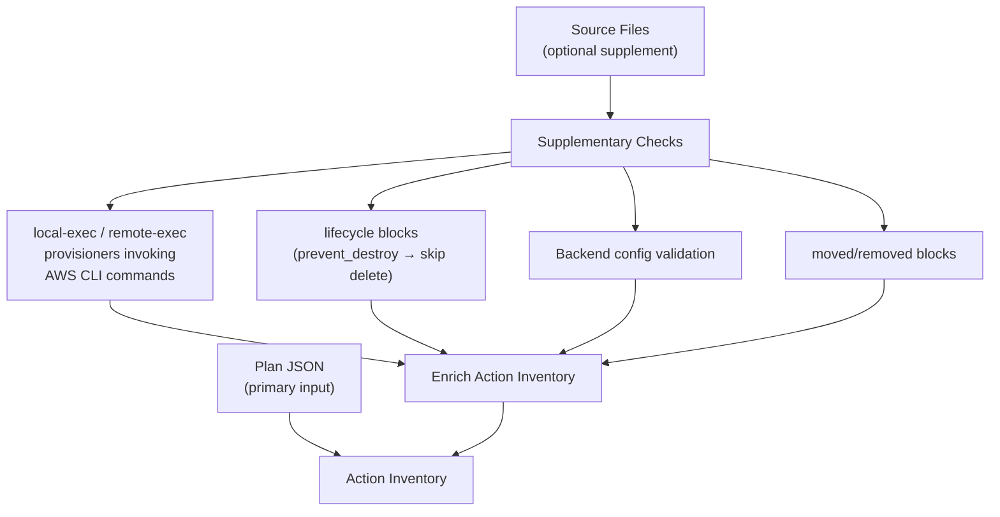

If source files are provided alongside plan JSON:

1. **Flag `local-exec` provisioners** invoking `aws` CLI — parse command, map to IAM actions
2. **Detect `lifecycle { prevent_destroy = true }`** — remove delete actions for that resource
3. **Cross-reference backend configuration** — validate toolchain permissions match declared backend
4. **Detect `moved` / `removed` blocks** — `moved` is state-only (no permissions), `removed` may need destroy permissions

## Toolchain Permissions (Always Included)

### Terraform — Always Required

| Action | Purpose | Resource | Role |
|---|---|---|---|
| `sts:GetCallerIdentity` | Provider initialization | `*` | Plan + Apply |
| `s3:GetObject` | Read state file | `arn:aws:s3:::${state_bucket}/${state_key_prefix}*` | Plan + Apply |
| `s3:ListBucket` | List state files | `arn:aws:s3:::${state_bucket}` | Plan + Apply |
| `s3:PutObject` | Write state file | `arn:aws:s3:::${state_bucket}/${state_key_prefix}*` | Apply only |
| `s3:DeleteObject` | Delete old state | `arn:aws:s3:::${state_bucket}/${state_key_prefix}*` | Apply only |
| `dynamodb:GetItem` | Check lock | `arn:aws:dynamodb:${region}:${account_id}:table/${lock_table}` | Plan + Apply |
| `dynamodb:PutItem` | Acquire lock | `arn:aws:dynamodb:${region}:${account_id}:table/${lock_table}` | Apply only |
| `dynamodb:DeleteItem` | Release lock | `arn:aws:dynamodb:${region}:${account_id}:table/${lock_table}` | Apply only |

### CDK — Always Required

| Action | Purpose | Resource | Role |
|---|---|---|---|
| `sts:GetCallerIdentity` | Account resolution | `*` | Plan + Apply |
| `cloudformation:DescribeStacks` | Check stack state | `arn:aws:cloudformation:${region}:${account_id}:stack/<stack-patterns>/*` | Plan + Apply |
| `cloudformation:GetTemplate` | Diff current template | `arn:aws:cloudformation:${region}:${account_id}:stack/<stack-patterns>/*` | Plan + Apply |
| `cloudformation:GetTemplateSummary` | Template analysis | `*` | Plan + Apply |
| `cloudformation:ListStacks` | Enumerate stacks | `*` | Plan + Apply |
| `cloudformation:DescribeStackEvents` | Deployment monitoring | `arn:aws:cloudformation:${region}:${account_id}:stack/<stack-patterns>/*` | Plan + Apply |
| `cloudformation:DescribeStackResources` | Resource enumeration | `arn:aws:cloudformation:${region}:${account_id}:stack/<stack-patterns>/*` | Plan + Apply |
| `cloudformation:ListStackResources` | Resource enumeration | `arn:aws:cloudformation:${region}:${account_id}:stack/<stack-patterns>/*` | Plan + Apply |
| `cloudformation:CreateStack` | Create new stack | `arn:aws:cloudformation:${region}:${account_id}:stack/<stack-patterns>/*` | Apply only |
| `cloudformation:UpdateStack` | Update existing stack | `arn:aws:cloudformation:${region}:${account_id}:stack/<stack-patterns>/*` | Apply only |
| `cloudformation:DeleteStack` | Destroy stack | `arn:aws:cloudformation:${region}:${account_id}:stack/<stack-patterns>/*` | Apply only |
| `cloudformation:CreateChangeSet` | Prepare changes | `arn:aws:cloudformation:${region}:${account_id}:stack/<stack-patterns>/*` | Apply only |
| `cloudformation:DescribeChangeSet` | Review changes | `arn:aws:cloudformation:${region}:${account_id}:stack/<stack-patterns>/*` | Plan + Apply |
| `cloudformation:ExecuteChangeSet` | Apply changes | `arn:aws:cloudformation:${region}:${account_id}:stack/<stack-patterns>/*` | Apply only |
| `cloudformation:DeleteChangeSet` | Cleanup | `arn:aws:cloudformation:${region}:${account_id}:stack/<stack-patterns>/*` | Apply only |
| `ssm:GetParameter` | Read bootstrap version | `arn:aws:ssm:${region}:${account_id}:parameter/cdk-bootstrap/${cdk_qualifier}/version` | Plan + Apply |
| `s3:GetObject`, `s3:ListBucket` | Read bootstrap bucket | `arn:aws:s3:::cdk-${cdk_qualifier}-assets-${account_id}-*` | Plan + Apply |
| `s3:PutObject`, `s3:DeleteObject` | Write assets | `arn:aws:s3:::cdk-${cdk_qualifier}-assets-${account_id}-*` | Apply only |
| `ecr:GetAuthorizationToken` | Docker auth (if container assets) | `*` | Apply only |
| `ecr:BatchCheckLayerAvailability`, `ecr:PutImage`, etc. | Push container assets | `arn:aws:ecr:${region}:${account_id}:repository/cdk-${cdk_qualifier}-container-assets-${account_id}-*` | Apply only |

## Resource-to-IAM-Action Mapping

For each resource type extracted from plan/synth JSON, the tool looks up the **`resource_actions` table** in the Action Mapping Database and selects the appropriate action categories based on the planned operation.

### Action Categories per Resource

| Category | When Needed | Role Assignment | Example: `aws_ecs_cluster` / `AWS::ECS::Cluster` |
|---|---|---|---|
| **Read/Describe** | Always for managed resources | Plan + Apply | `ecs:DescribeClusters`, `ecs:ListClusters` |
| **Create** | Plan action `["create"]` or `["create","delete"]` | Apply only | `ecs:CreateCluster` |
| **Update** | Plan action `["update"]` | Apply only | `ecs:UpdateCluster`, `ecs:UpdateClusterSettings` |
| **Delete** | Plan action `["delete"]` or `["create","delete"]` | Apply only | `ecs:DeleteCluster` |
| **Tag** | Any create/update with tags | Apply only | `ecs:TagResource`, `ecs:UntagResource` |

### Implicit Dependencies

Many resources require permissions on other services not obvious from the resource type. The tool detects these by scanning plan JSON `change.after` attributes against the **`implicit_triggers` table** in the Action Mapping Database, and resolving PassRole targets and SLR needs via the **`pass_role_targets`** and **`service_linked_roles`** tables.

| Trigger | Required Action | Condition/Scope | Role | Detection from Plan JSON |
|---|---|---|---|---|
| Resource associating IAM role | `iam:PassRole` | Target role ARN + `iam:PassedToService` | Apply only | `change.after` contains `role`, `task_role_arn`, `execution_role_arn`, `iam_instance_profile` |
| First use of ECS, ELB, RDS, etc. | `iam:CreateServiceLinkedRole` | `iam:AWSServiceName` condition | Apply only | Resource type is from a service requiring SLR |
| Resource producing CloudWatch logs | `logs:CreateLogGroup`, `logs:PutRetentionPolicy`, `logs:DescribeLogGroups` | Log group ARN pattern | Apply (create), Plan+Apply (describe) | `change.after` contains `log_configuration`, `log_group_name` |
| KMS-encrypted resource | `kms:DescribeKey`, `kms:CreateGrant`, `kms:GenerateDataKey`, `kms:Decrypt` | KMS key ARN | Apply (grant/gen/decrypt), Plan+Apply (describe) | `change.after` contains `kms_key_id`, `kms_key_arn` |
| Separate tagging APIs | `<service>:TagResource`, `<service>:UntagResource` | Same resource scope | Apply only | `change.after.tags` is non-null |
| IaC creates IAM roles | `iam:CreateRole`, `iam:PutRolePolicy`, etc. | Role ARN pattern + permission boundary | Apply only | `type` is `aws_iam_role` / `AWS::IAM::Role` |
| IaC creates instance profiles | `iam:CreateInstanceProfile`, `iam:AddRoleToInstanceProfile` | Instance profile ARN pattern | Apply only | `type` is `aws_iam_instance_profile` / `AWS::IAM::InstanceProfile` |

## Phase 1 Output: Action Inventory

```json
{
  "metadata": {
    "iac_tool": "terraform",
    "iac_version": "1.7.0",
    "provider_version": "5.40.0",
    "plan_generated_at": "2025-02-07T10:30:00Z",
    "source_analysis_included": true
  },

  "toolchain_actions": {
    "plan_and_apply": [
      {
        "action": "s3:GetObject",
        "resource": "arn:aws:s3:::${state_bucket}/${state_key_prefix}*",
        "purpose": "Read Terraform state",
        "category": "toolchain"
      }
    ],
    "apply_only": [
      {
        "action": "s3:PutObject",
        "resource": "arn:aws:s3:::${state_bucket}/${state_key_prefix}*",
        "purpose": "Write Terraform state",
        "category": "toolchain"
      }
    ]
  },

  "infrastructure_actions": {
    "plan_and_apply": [
      {
        "action": "ecs:DescribeClusters",
        "resource": "arn:aws:ecs:${region}:${account_id}:cluster/${resource_prefix}-*",
        "purpose": "Read ECS cluster state for plan/diff",
        "source_resource": "aws_ecs_cluster.main",
        "plan_action": "create",
        "category": "read",
        "supports_resource_scoping": true
      }
    ],
    "apply_only": [
      {
        "action": "ecs:CreateCluster",
        "resource": "arn:aws:ecs:${region}:${account_id}:cluster/${resource_prefix}-*",
        "purpose": "Create ECS cluster",
        "source_resource": "aws_ecs_cluster.main",
        "plan_action": "create",
        "category": "create",
        "supports_resource_scoping": true
      }
    ]
  },

  "implicit_dependencies": [
    {
      "action": "iam:PassRole",
      "resource": "arn:aws:iam::${account_id}:role/${resource_prefix}-*-execution-role",
      "condition": {
        "StringEquals": {
          "iam:PassedToService": "ecs-tasks.amazonaws.com"
        }
      },
      "triggered_by": "aws_ecs_service.main",
      "detected_from": "change.after.task_definition → execution_role_arn",
      "role": "apply_only"
    }
  ],

  "supplementary_findings": [
    {
      "type": "provisioner",
      "resource": "aws_instance.bastion",
      "provisioner_type": "local-exec",
      "command": "aws ssm put-parameter ...",
      "message": "local-exec invokes AWS CLI — additional permissions may be needed",
      "source": "source_analysis"
    },
    {
      "type": "lifecycle",
      "resource": "aws_s3_bucket.data",
      "prevent_destroy": true,
      "message": "prevent_destroy set — delete actions removed from inventory",
      "source": "source_analysis"
    }
  ]
}
```

---

# Phase 2: Policy Formulation

## Purpose

Transform the Phase 1 action inventory into candidate JSON policy documents, collecting user input where needed, splitting into plan and apply roles.

## User Input Required

### Required Inputs

| Input | Description | Example |
|---|---|---|
| `github_org` | GitHub organization name | `my-org` |
| `github_repo` | Repository (or repos) assuming the role | `infra-repo` |
| `environments` | Target environments | `["dev", "staging", "prod"]` |
| `resource_prefix` | Naming convention prefix | `myteam-${environment}` |
| `use_github_environments` | GitHub Environments configured? | `true` / `false` |
| `github_environment_names` | Environment name mapping (if applicable) | `{"dev": "development", "prod": "production"}` |

### Optional Inputs (with defaults)

| Input | Default | Description |
|---|---|---|
| `plan_apply_separation` | `true` | Generate separate plan and apply roles |
| `include_delete_actions` | `true` | Include Delete actions in apply role |
| `oidc_provider_exists` | `false` | OIDC provider already configured |
| `permission_boundary_arn` | `null` | Permission boundary for roles this IaC creates |
| `role_path` | `/` | IAM role path |
| `role_name_pattern` | `${resource_prefix}-github-{plan\|apply}` | Role naming convention |
| `mandatory_tags` | `null` | Required tags for `aws:RequestTag` conditions |

**Auto-detected from plan JSON** (no input needed):
- State bucket, key prefix, lock table (from `configuration.backend`)
- CDK qualifier (from bootstrap stack metadata)
- Provider region (from `configuration.provider_config`)
- Resource naming patterns (from `change.after` attributes)
- Default tags (from provider `default_tags`)

## Policy Construction Pipeline

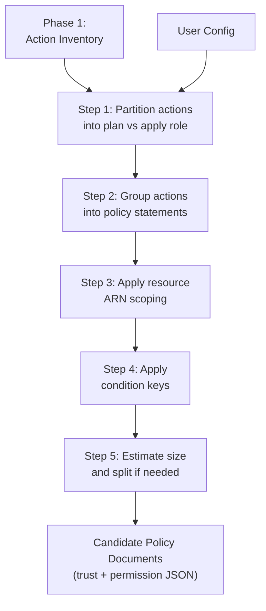

### Step 1: Partition Actions

- `plan_and_apply` → both roles
- `apply_only` → apply role only
- All Read/Describe/List/Get → `plan_and_apply`
- All Create/Update/Delete/Put/Tag → `apply_only`
- `iam:PassRole`, `iam:CreateServiceLinkedRole` → `apply_only`
- `iam:Create*`, `iam:Put*`, `iam:Attach*`, `iam:Delete*`, `iam:Detach*` → `apply_only`
- `iam:GetRole`, `iam:GetRolePolicy`, `iam:ListAttachedRolePolicies`, `iam:ListRolePolicies`, `iam:GetInstanceProfile` → `plan_and_apply`

### Step 2: Group into Statements

Each statement gets a descriptive `Sid` and groups actions from the same service sharing resource scope and conditions.

Grouping strategy:
1. Toolchain (state backend, CDK bootstrap) → separate statements
2. Infrastructure by service family → group related services
3. Read-only referenced resources → single statement for Describe/Get/List on `*`
4. IAM management → separate statements with strict scoping
5. Implicit dependencies (PassRole, ServiceLinkedRoles) → separate statements

### Step 3: Apply Resource Scoping

For each statement, construct the most restrictive `Resource` value using the **`arn_patterns` table** from the Action Mapping Database:

1. **Specific ARN with prefix**: Look up the resource type in `arn_patterns` — if `supports_name_scoping` is true, substitute `${resource_prefix}-*` into the pattern. Detect actual naming patterns from plan JSON `change.after` attributes when available.
2. **Resource `*` with conditions**: When `arn_patterns` indicates `supports_name_scoping: false` (e.g., VPCs, security groups with auto-generated IDs), use `*` with the `recommended_condition` from the table (typically tag-based).
3. **Resource `*` (unavoidable)**: For actions listed in the **`unscoped_actions` table** — these legitimately require `Resource: "*"` because AWS doesn't support resource-level permissions.

### Step 4: Apply Conditions

| Condition | When to Apply |
|---|---|
| `aws:RequestedRegion` | All region-scoped actions, especially when Resource uses `*` for region |
| `aws:RequestTag` | Resource creation if mandatory tags configured |
| `aws:ResourceTag` | Actions on existing resources if tag scoping viable |
| `iam:PermissionsBoundary` | Any `iam:CreateRole` |
| `iam:PassedToService` | All `iam:PassRole` |
| `iam:AWSServiceName` | All `iam:CreateServiceLinkedRole` |

### Step 5: Size and Split

1. Serialize to JSON, measure bytes
2. Under 6,144 → single managed policy per role
3. Over → split by logical function
4. Max 10 managed policies per role
5. Plan role rarely hits limits

## Trust Policy Generation

### Apply Role

```json
{
  "Version": "2012-10-17",
  "Statement": [
    {
      "Sid": "AllowGitHubOIDC",
      "Effect": "Allow",
      "Principal": {
        "Federated": "arn:aws:iam::${account_id}:oidc-provider/token.actions.githubusercontent.com"
      },
      "Action": "sts:AssumeRoleWithWebIdentity",
      "Condition": {
        "StringEquals": {
          "token.actions.githubusercontent.com:aud": "sts.amazonaws.com",
          "token.actions.githubusercontent.com:sub": "repo:${org}/${repo}:ref:refs/heads/main"
        }
      }
    }
  ]
}
```

With GitHub Environments, replace `sub`:
```json
"token.actions.githubusercontent.com:sub": "repo:${org}/${repo}:environment:${github_environment_name}"
```

### Plan Role

```json
{
  "Version": "2012-10-17",
  "Statement": [
    {
      "Sid": "AllowGitHubOIDCPlanOnPR",
      "Effect": "Allow",
      "Principal": {
        "Federated": "arn:aws:iam::${account_id}:oidc-provider/token.actions.githubusercontent.com"
      },
      "Action": "sts:AssumeRoleWithWebIdentity",
      "Condition": {
        "StringEquals": {
          "token.actions.githubusercontent.com:aud": "sts.amazonaws.com",
          "token.actions.githubusercontent.com:sub": "repo:${org}/${repo}:pull_request"
        }
      }
    }
  ]
}
```

**Multiple repositories** — use a list for `sub`.

**Trust policy invariants:**
- Never use org-wide wildcards (`repo:${org}/*`)
- Always use `StringEquals` when exact value is known
- Always include `aud` condition

## Phase 2 Output

```json
{
  "roles": [
    {
      "role_name": "${resource_prefix}-github-plan",
      "role_path": "/",
      "description": "Read-only role for terraform plan / cdk diff on pull requests",
      "max_session_duration": 3600,
      "permission_boundary_arn": null,
      "trust_policy": {},
      "permission_policies": [
        {
          "policy_name": "${resource_prefix}-github-plan-permissions",
          "policy_document": {},
          "estimated_size_bytes": 2048
        }
      ]
    },
    {
      "role_name": "${resource_prefix}-github-apply",
      "role_path": "/",
      "description": "Full CRUD role for terraform apply / cdk deploy on merge to main",
      "max_session_duration": 3600,
      "permission_boundary_arn": null,
      "trust_policy": {},
      "permission_policies": [
        {
          "policy_name": "${resource_prefix}-github-apply-permissions",
          "policy_document": {},
          "estimated_size_bytes": 4896
        }
      ]
    }
  ],
  "template_variables": {
    "account_id": "Target AWS account ID",
    "region": "Target region or * for multi-region",
    "environment": "Environment name",
    "resource_prefix": "myteam-${environment}",
    "org": "my-org",
    "repo": "infra-repo"
  }
}
```

---

# Phase 3: Validate & Fix

## Purpose

Validate candidate policy documents against a local OPA/WASM policy engine encoding least-privilege best practices and (over time) reverse-engineered 3rd party scanner rules. Auto-fix deterministic violations. Produce machine-readable hints for agent-assisted fixes.

## Part 1: OPA/WASM Policy Engine

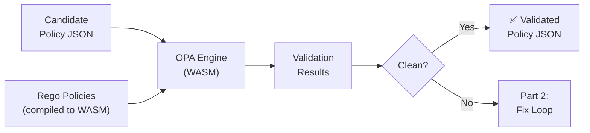

Runs locally — no external dependencies, no network calls.

### Baseline Rego Policy Set

#### Category 1: Action Scoping

| Rule ID | Severity | Description |
|---|---|---|
| `LP-001` | `error` | No global wildcard actions (`"Action": "*"`) |
| `LP-002` | `error` | No service-level wildcard actions (`"Action": "s3:*"`) |
| `LP-003` | `warning` | Flag `NotAction` usage |
| `LP-004` | `error` | No deny-listed actions: `organizations:*`, `account:*`, `iam:CreateUser`, `iam:CreateAccessKey`, `iam:CreateLoginProfile`, unscoped `sts:AssumeRole` |
| `LP-005` | `warning` | Flag overly broad actions: `ec2:*`, `s3:*`, `lambda:*` |

#### Category 2: Resource Scoping

| Rule ID | Severity | Description |
|---|---|---|
| `LP-010` | `error` | No `"Resource": "*"` on actions supporting resource-level permissions (allowlist from **`unscoped_actions`** table in Action Mapping Database) |
| `LP-011` | `warning` | Flag `Resource: "*"` even on unscoped actions — encourage conditions |
| `LP-012` | `error` | ARNs must not hardcode account IDs (use `${account_id}`) |
| `LP-013` | `warning` | ARNs with only `*` in resource segment should have conditions |

#### Category 3: Condition Requirements

| Rule ID | Severity | Description |
|---|---|---|
| `LP-020` | `error` | `iam:PassRole` Resource must not be `*` |
| `LP-021` | `error` | `iam:PassRole` must have `iam:PassedToService` condition |
| `LP-022` | `error` | `iam:CreateRole` must have `iam:PermissionsBoundary` condition (if configured) |
| `LP-023` | `error` | `iam:CreateServiceLinkedRole` must have `iam:AWSServiceName` condition |
| `LP-024` | `warning` | `Resource: "*"` on region-scoped services should have `aws:RequestedRegion` |
| `LP-025` | `warning` | Resource creation should have `aws:RequestTag` if mandatory tags configured |

#### Category 4: Trust Policy

| Rule ID | Severity | Description |
|---|---|---|
| `LP-030` | `error` | Must use `sts:AssumeRoleWithWebIdentity` |
| `LP-031` | `error` | Must include `aud` condition with `sts.amazonaws.com` |
| `LP-032` | `error` | Must include `sub` condition |
| `LP-033` | `error` | `sub` must not use org-wide wildcard |
| `LP-034` | `warning` | Prefer `StringEquals` over `StringLike` when no wildcards needed |
| `LP-035` | `error` | Plan role must use `pull_request` subject |
| `LP-036` | `error` | Apply role must use `ref:refs/heads/main` or `environment:<n>` subject |

#### Category 5: Policy Structure

| Rule ID | Severity | Description |
|---|---|---|
| `LP-040` | `error` | Must include `"Version": "2012-10-17"` |
| `LP-041` | `error` | Every statement must have explicit `Sid` |
| `LP-042` | `error` | Policy size must not exceed 6,144 bytes |
| `LP-043` | `warning` | Statements should not exceed 20 actions |
| `LP-044` | `warning` | Max 10 managed policies per role |
| `LP-045` | `error` | No duplicate actions within same statement |
| `LP-046` | `warning` | No duplicate actions across statements |

#### Category 6: Privilege Escalation Prevention

| Rule ID | Severity | Description |
|---|---|---|
| `LP-050` | `error` | No `iam:PutRolePolicy`/`iam:AttachRolePolicy` on deployment role's own ARN |
| `LP-051` | `error` | No `iam:CreatePolicyVersion` on deployment role's own policies |
| `LP-052` | `error` | If `iam:CreateRole` present, `iam:PassRole` scoped to only created roles |
| `LP-053` | `warning` | Flag `iam:Put*Policy`/`iam:Attach*Policy` without resource scoping |

### Example Rego Rule

```rego
package iampolicy.leastprivilege

# LP-001: No global wildcard actions
deny[result] {
    statement := input.policy_document.Statement[i]
    statement.Effect == "Allow"
    action := statement.Action[_]
    action == "*"
    result := {
        "rule_id": "LP-001",
        "severity": "error",
        "message": "Global wildcard action (*) is not permitted",
        "statement_sid": statement.Sid,
        "statement_index": i,
        "field": "Action",
        "current_value": "*",
        "auto_fixable": false,
        "fix_hint": "Replace * with specific actions for resources in this statement"
    }
}

# LP-021: iam:PassRole must have iam:PassedToService condition
deny[result] {
    statement := input.policy_document.Statement[i]
    statement.Effect == "Allow"
    action := statement.Action[_]
    action == "iam:PassRole"
    not has_condition(statement, "StringEquals", "iam:PassedToService")
    not has_condition(statement, "StringLike", "iam:PassedToService")
    result := {
        "rule_id": "LP-021",
        "severity": "error",
        "message": "iam:PassRole must include iam:PassedToService condition",
        "statement_sid": statement.Sid,
        "statement_index": i,
        "field": "Condition",
        "current_value": null,
        "auto_fixable": true,
        "fix_hint": "Add Condition.StringEquals.iam:PassedToService",
        "fix_data": {
            "condition_key": "iam:PassedToService",
            "suggested_values": "Infer from action inventory triggered_by field"
        }
    }
}
```

### Validation Results Schema

```json
{
  "role_name": "${resource_prefix}-github-apply",
  "policy_name": "${resource_prefix}-github-apply-permissions",
  "valid": false,
  "violations": [
    {
      "rule_id": "LP-021",
      "severity": "error",
      "message": "iam:PassRole must include iam:PassedToService condition",
      "statement_sid": "PassRole",
      "statement_index": 3,
      "field": "Condition",
      "current_value": null,
      "auto_fixable": true,
      "fix_hint": "Add Condition.StringEquals.iam:PassedToService",
      "fix_data": {
        "condition_key": "iam:PassedToService",
        "suggested_values": ["ecs-tasks.amazonaws.com"]
      }
    }
  ],
  "warnings": [],
  "stats": {
    "total_statements": 8,
    "total_actions": 47,
    "errors": 2,
    "warnings": 3,
    "auto_fixable_errors": 1,
    "auto_fixable_warnings": 2
  }
}
```

## Part 2: Fix Loop

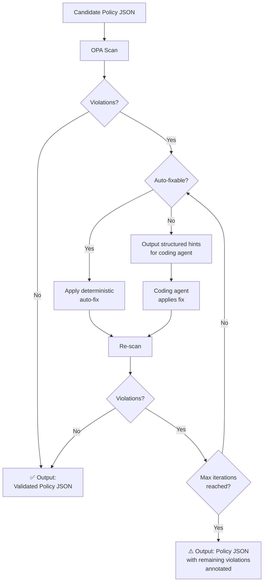

### Auto-Fix Rules (v1)

Deterministic given Phase 2 inputs — no new information needed.

| Rule ID | Auto-Fix Logic |
|---|---|
| `LP-021` | Add `iam:PassedToService` — look up resource type in **`pass_role_targets`** table |
| `LP-023` | Add `iam:AWSServiceName` — look up service in **`service_linked_roles`** table |
| `LP-024` | Add `aws:RequestedRegion` using configured region(s) |
| `LP-025` | Add `aws:RequestTag` using `mandatory_tags` from config |
| `LP-031` | Add missing `aud` condition with `sts.amazonaws.com` |
| `LP-034` | Replace `StringLike` with `StringEquals` when no wildcards |
| `LP-040` | Add `"Version": "2012-10-17"` |
| `LP-041` | Generate `Sid` from action group + role |
| `LP-045` | Deduplicate actions within statement |
| `LP-046` | Move duplicates to statement with more specific resource scope |

### Agent-Assisted Fix Hints

For non-auto-fixable violations:

```json
{
  "rule_id": "LP-010",
  "severity": "error",
  "action_required": "Scope Resource to specific ARN pattern",
  "context": {
    "statement_sid": "ECSManagement",
    "current_resource": "*",
    "action": "ecs:CreateCluster",
    "supports_resource_scoping": true,
    "suggested_arn_pattern": "arn:aws:ecs:${region}:${account_id}:cluster/${resource_prefix}-*"
  },
  "instructions": "Replace Resource: * with scoped ARN. Use resource_prefix template variable.",
  "requires_user_input": false,
  "suggested_fix": {
    "field": "Resource",
    "new_value": "arn:aws:ecs:${region}:${account_id}:cluster/${resource_prefix}-*"
  }
}
```

For hints requiring user input:
```json
{
  "rule_id": "LP-010",
  "severity": "error",
  "action_required": "Scope Resource for iam:PutRolePolicy",
  "context": {
    "statement_sid": "IAMRoleManagement",
    "current_resource": "*",
    "action": "iam:PutRolePolicy"
  },
  "instructions": "iam:PutRolePolicy with Resource: * allows writing policies to any role. Scope to created role ARN patterns.",
  "requires_user_input": true,
  "user_prompt": "What naming pattern do IAM roles created by your IaC follow?"
}
```

### Fix Loop Safety

- Auto-fixes must be idempotent
- Detect oscillation and halt with error
- Max iterations: 5 (configurable)
- Each iteration logs changes for auditability

---

# Appendix A: Database Table Quick Reference

The tables below summarize the starter data for each Action Mapping Database table. The canonical source of truth is the YAML files in the `action-mapping-db/` directory. These appendix tables are for quick reference only — when in doubt, consult the YAML files.

## `pass_role_targets` — Quick Reference

| Resource Type (Terraform / CloudFormation) | Passed-to Service |
|---|---|
| `aws_ecs_service` / `AWS::ECS::Service` | `ecs-tasks.amazonaws.com` |
| `aws_ecs_task_definition` / `AWS::ECS::TaskDefinition` | `ecs-tasks.amazonaws.com` |
| `aws_lambda_function` / `AWS::Lambda::Function` | `lambda.amazonaws.com` |
| `aws_instance` / `AWS::EC2::Instance` (with instance profile) | `ec2.amazonaws.com` |
| `aws_codebuild_project` / `AWS::CodeBuild::Project` | `codebuild.amazonaws.com` |
| `aws_codepipeline` / `AWS::CodePipeline::Pipeline` | `codepipeline.amazonaws.com` |
| `aws_sfn_state_machine` / `AWS::StepFunctions::StateMachine` | `states.amazonaws.com` |
| `aws_batch_compute_environment` / `AWS::Batch::ComputeEnvironment` | `batch.amazonaws.com` |
| `aws_sagemaker_notebook_instance` / `AWS::SageMaker::NotebookInstance` | `sagemaker.amazonaws.com` |
| `aws_glue_job` / `AWS::Glue::Job` | `glue.amazonaws.com` |
| `aws_eks_node_group` / `AWS::EKS::Nodegroup` | `ec2.amazonaws.com` |
| `aws_firehose_delivery_stream` / `AWS::KinesisFirehose::DeliveryStream` | `firehose.amazonaws.com` |

## `service_linked_roles` — Quick Reference

| Trigger Service | Service-Linked Role Service Name |
|---|---|
| ECS | `ecs.amazonaws.com` |
| ELB / ALB / NLB | `elasticloadbalancing.amazonaws.com` |
| RDS | `rds.amazonaws.com` |
| Auto Scaling | `autoscaling.amazonaws.com` |
| ElastiCache | `elasticache.amazonaws.com` |
| OpenSearch | `opensearchservice.amazonaws.com` |
| EKS | `eks.amazonaws.com` |
| Lambda (VPC-enabled) | `lambda.amazonaws.com` |
| Spot | `spot.amazonaws.com` |
| Transit Gateway | `transitgateway.amazonaws.com` |

## `unscoped_actions` — Quick Reference

Actions that legitimately require `Resource: "*"`. The `LP-010` rule uses this as its allowlist.

```
ec2:Describe*                       (most ec2:Describe actions)
ecs:List*                           (ListClusters, ListServices, etc.)
elasticloadbalancing:Describe*      (most ELB describe actions)
rds:DescribeDBInstances, DescribeDBClusters, DescribeDBSubnetGroups
lambda:ListFunctions, ListLayers, GetAccountSettings
cloudwatch:DescribeAlarms, ListMetrics
logs:DescribeLogGroups
sns:ListTopics
sqs:ListQueues
route53:ListHostedZones, GetHostedZoneCount
acm:ListCertificates
secretsmanager:ListSecrets
ssm:DescribeParameters
sts:GetCallerIdentity
cloudformation:ListStacks, GetTemplateSummary
```

See `unscoped_actions.yaml` for the complete, authoritative list.